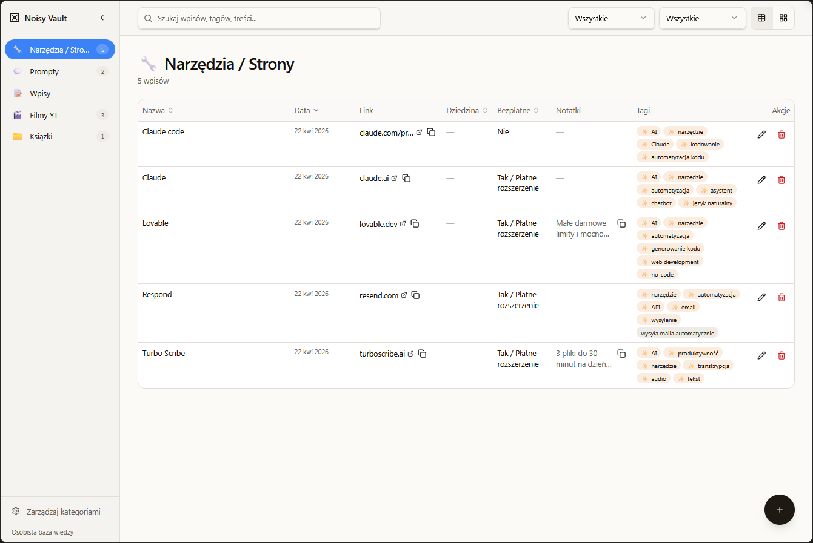

# Noisy Vault — Jak zremiksować aplikację do zarządzania wiedzą osobistą

Instrukcja krok po kroku, jak zremiksować gotową aplikację [Noisy Vault](https://lovable.dev/projects/63239106-63fa-4c6a-8bb4-250664eb1121) w [Lovable](https://lovable.dev) i uruchomić ją z własnymi danymi — bez pisania kodu.

**Czas realizacji:** ~20–30 minut  
**Wymagania:** Konto w Lovable (darmowe), konto Google, konto Anthropic  
**Efekt końcowy:** Własna kopia aplikacji z bazą danych, AI do tagowania i automatycznym pobieraniem metadanych YouTube

> ⚠️ **Darmowy plan Lovable: 5 kredytów dziennie.** Remiks i konfiguracja nie zużywają kredytów — kredyty są potrzebne tylko gdy wysyłasz własne prompty do modyfikacji aplikacji.



---

## Spis treści

1. [Krok 1: Remiks projektu w Lovable](#krok-1-remiks-projektu-w-lovable)
2. [Krok 2: Konfiguracja kluczy API](#krok-2-konfiguracja-kluczy-api)
3. [Krok 3: Eksport danych z bazy oryginalnego projektu](#krok-3-eksport-danych-z-bazy-oryginalnego-projektu)
4. [Krok 4: Import danych do nowej bazy](#krok-4-import-danych-do-nowej-bazy)
5. [Krok 5: Weryfikacja](#krok-5-weryfikacja)
6. [Funkcjonalności aplikacji](#funkcjonalności-aplikacji)

---

## Krok 1: Remiks projektu w Lovable

**Co robimy:** Kopiujemy cały kod aplikacji do własnego projektu. Remiks tworzy nowy projekt z identycznym kodem, ale pustą bazą danych — dane dodamy w kolejnych krokach.

**Kroki:**

1. Wejdź na stronę projektu: [https://lovable.dev/projects/63239106-63fa-4c6a-8bb4-250664eb1121](https://lovable.dev/projects/63239106-63fa-4c6a-8bb4-250664eb1121)
2. Kliknij przycisk **"Remix"** w prawym górnym rogu
3. Zaloguj się lub utwórz konto w Lovable (jeśli jeszcze nie masz)
4. Poczekaj chwilę — Lovable skopiuje projekt i przeniesie Cię do nowego edytora
5. Nadaj projektowi własną nazwę (opcjonalnie)

**Częste problemy:**

- ⚠️ Przycisk "Remix" nie jest widoczny — upewnij się że jesteś zalogowany w Lovable
- ⚠️ Po remiksie aplikacja może pokazywać błąd bazy danych — to normalne, bo baza jest pusta. Dane dodamy w Kroku 4
- ⚠️ Remiks może chwilę trwać przy wolniejszym połączeniu — nie odświeżaj strony w trakcie

---

## Krok 2: Konfiguracja kluczy API

**Co robimy:** Aplikacja korzysta z dwóch zewnętrznych API — Claude (do generowania tagów) i YouTube Data API (do pobierania metadanych filmów). Oba wymagają własnych kluczy, które dodajesz w ustawieniach projektu.

### 2a. Klucz Anthropic (Claude API)

> 💡 Upewnij się że jesteś zalogowany na [console.anthropic.com](https://console.anthropic.com) przed kliknięciem w poniższy link.

1. Przejdź bezpośrednio do: [https://platform.claude.com/settings/workspaces/default/keys](https://platform.claude.com/settings/workspaces/default/keys)
2. Kliknij **"Create Key"**
3. Nadaj kluczowi nazwę (np. "Noisy Vault")
4. Skopiuj wygenerowany klucz — zaczyna się od `sk-ant-...`

> ⚠️ Klucz jest widoczny tylko raz po wygenerowaniu. Skopiuj go od razu.

### 2b. Klucz YouTube Data API v3

> 💡 Upewnij się że jesteś zalogowany na [console.cloud.google.com](https://console.cloud.google.com) przed kliknięciem w poniższe linki.

1. Utwórz nowy projekt Google Cloud lub wybierz istniejący
2. Włącz YouTube Data API v3: [https://console.cloud.google.com/apis/library/youtube.googleapis.com](https://console.cloud.google.com/apis/library/youtube.googleapis.com) — kliknij **"Włącz"**
3. Przejdź do tworzenia klucza: [https://console.cloud.google.com/apis/credentials](https://console.cloud.google.com/apis/credentials) — kliknij **"Utwórz dane uwierzytelniające" → "Klucz API"**
4. W polu **"Wybierz ograniczenia interfejsu API"** wybierz **"YouTube Data API v3"**
5. Pozostaw **"Ograniczenia aplikacji"** jako **"Brak"** i **nie zaznaczaj** checkboxa "Uwierzytelniaj wywołania za pomocą konta usługi"
6. Kliknij **"Utwórz"** i skopiuj klucz — zaczyna się od `AIzaSy...`

> 💡 YouTube Data API daje **10 000 jednostek dziennie** (reset o północy czasu pacyficznego). Pobranie metadanych jednego filmu kosztuje 1 jednostkę — dla osobistego użytku limit jest praktycznie nieograniczony.

### 2c. Dodanie kluczy do Lovable

1. W swoim projekcie w Lovable kliknij menu **"Cloud"** w górnym pasku
2. Wybierz **"Secrets"**
3. Dodaj dwa wpisy:
   - Nazwa: `ANTHROPIC_API_KEY` → Wartość: twój klucz Anthropic
   - Nazwa: `YOUTUBE_API_KEY` → Wartość: twój klucz YouTube

**Częste problemy:**

- ⚠️ Link do Anthropic przekierowuje do logowania — zaloguj się i kliknij w link ponownie
- ⚠️ Klucz YouTube nie działa od razu — nowe klucze Google mogą potrzebować kilku minut na aktywację
- ⚠️ Jeśli generowanie tagów zwraca błąd "Brak klucza" — sprawdź czy nazwa zmiennej to dokładnie `ANTHROPIC_API_KEY` (wielkość liter ma znaczenie)
- ⚠️ Nigdy nie wklejaj kluczy w czacie, mailu ani dokumencie — tylko bezpośrednio w polu Secrets w Lovable

---

## Krok 3: Eksport danych z bazy oryginalnego projektu

**Co robimy:** Generujemy kod SQL który odtworzy kategorie i przykładowe wpisy w nowej bazie danych. Tagi nie wymagają eksportu — są generowane przez AI na żądanie.

> 💡 Kroki 3 i 4 wykonujesz naprzemiennie: wyciągasz dane z jednej tabeli w starej bazie, od razu wklejasz je do nowej bazy, a dopiero potem wracasz po dane z kolejnej tabeli.

> ⚠️ Nie eksportuj wyników do pliku .csv — pojawi się dużo cudzysłowów (`"`) których ręczna korekta zajmie dużo czasu. Przy niewielkiej liczbie wpisów skopiuj wyniki bezpośrednio z okna wyników SQL Editor.

**Gdzie wpisać zapytanie:** W Supabase oryginalnego projektu otwórz **SQL Editor** (lewy pasek) i wklej poniższe zapytanie. Uruchom je przyciskiem **"Run"**.

Poniższe zapytanie zwraca gotowe instrukcje INSERT dla tabeli `categories`. To jedyne zapytanie które musisz samodzielnie uruchomić — wyniki dla tabeli `items` znajdziesz gotowe poniżej w Kroku 4:

```sql
SELECT 'INSERT INTO categories (id, name, icon, color, default_view, fields_schema, sort_order, created_at) VALUES (' ||
  quote_literal(id) || ', ' ||
  quote_literal(name) || ', ' ||
  quote_literal(icon) || ', ' ||
  quote_literal(color) || ', ' ||
  quote_literal(default_view) || ', ' ||
  quote_literal(fields_schema::text) || '::jsonb, ' ||
  sort_order || ', ' ||
  quote_literal(created_at) || ');'
FROM categories
ORDER BY sort_order;
```

Skopiuj wyniki z okna poniżej zapytania — to będą gotowe instrukcje INSERT do wklejenia w następnym kroku.


**Przykładowy wynik — INSERT dla `categories`:**

```sql
INSERT INTO categories (id, name, icon, color, default_view, fields_schema, sort_order, created_at) VALUES ('7a2a42d3-3949-4565-9f7b-02913b4d29d1', 'Narzędzia / Strony', '🔧', '#3b82f6', 'table', '{"fields": [{"key": "url", "type": "url", "label": "Link", "required": true}, {"key": "domain", "type": "select", "label": "Dziedzina", "options": ["AI", "Design", "Wideo", "Pisanie", "Dev", "Inne"]}, {"key": "is_free", "type": "select", "label": "Bezpłatne", "options": ["Tak", "Tak / Płatne rozszerzenie", "Nie"], "required": true}, {"key": "notes", "type": "textarea", "label": "Notatki"}]}'::jsonb, 1, '2026-04-19 18:20:20.613788+00');
INSERT INTO categories (id, name, icon, color, default_view, fields_schema, sort_order, created_at) VALUES ('c0668abe-b1c8-48d6-aa65-745fe24b3009', 'Prompty', '💬', '#a855f7', 'table', '{"fields": [{"key": "prompt_text", "type": "textarea", "label": "Treść promptu", "required": true}, {"key": "use_case", "type": "text", "label": "Zastosowanie", "required": false}, {"key": "output_example", "type": "textarea", "label": "Przykład wyniku", "required": false}]}'::jsonb, 2, '2026-04-19 18:20:20.613788+00');
INSERT INTO categories (id, name, icon, color, default_view, fields_schema, sort_order, created_at) VALUES ('4905c8bb-1f5c-4986-b2a0-b8a877b430cc', 'Wpisy', '📝', '#10b981', 'table', '{"fields": [{"key": "content", "type": "textarea", "label": "Treść", "required": true}, {"key": "source_url", "type": "url", "label": "Źródło"}, {"key": "topic", "type": "text", "label": "Temat"}]}'::jsonb, 3, '2026-04-19 18:20:20.613788+00');
INSERT INTO categories (id, name, icon, color, default_view, fields_schema, sort_order, created_at) VALUES ('7ba75482-4a09-4335-9b08-4bcf0b3aa304', 'Filmy YT', '🎬', '#ef4444', 'cards', '{"fields": [{"key": "youtube_url", "type": "youtube", "label": "Link YouTube", "required": true}, {"key": "channel", "type": "text", "label": "Kanał", "required": false}, {"key": "description", "type": "textarea", "label": "Opis", "required": false}, {"key": "duration", "type": "text", "label": "Czas trwania", "required": false}, {"key": "published_at", "type": "date", "label": "Data publikacji", "required": false}, {"key": "my_notes", "type": "textarea", "label": "Moje notatki", "required": false}, {"key": "thumbnail_url", "type": "image_url", "label": "Miniatura", "required": false}]}'::jsonb, 4, '2026-04-19 18:20:20.613788+00');
INSERT INTO categories (id, name, icon, color, default_view, fields_schema, sort_order, created_at) VALUES ('b96cb6db-45ff-4af5-ac6b-d3d25d313268', 'Książki', '📁', '#33dd95', 'table', '{"fields": [{"key": "autor", "type": "text", "label": "Autor", "required": true}, {"key": "polecam", "type": "select", "label": "Polecam", "options": ["Tak", "średnio", "Bardzo polecam"], "required": false}]}'::jsonb, 5, '2026-04-19 20:48:25.955935+00');
```


**Częste problemy:**

- ⚠️ Zapytanie nie zwraca żadnych wyników — tabela jest pusta, nic nie eksportujesz
- ⚠️ Błąd "relation does not exist" — upewnij się że jesteś w SQL Editor właściwego projektu Supabase

---

## Krok 4: Import danych do nowej bazy

**Co robimy:** Wgrywamy dane do bazy Supabase nowego projektu (powstałego po remiksie w Kroku 1).

> 💡 Pamiętaj o naprzemienności — po wklejeniu wyników dla `categories` od razu wgraj je do nowej bazy, a potem wróć do Kroku 3 po dane dla `items`.

**Gdzie wkleić:** W Supabase **nowego** projektu (remiksu) otwórz **SQL Editor** i wklej poniższe instrukcje INSERT. Uruchamiaj każdy blok osobno przyciskiem **"Run"**.

### INSERT dla tabeli `categories`:

```sql
INSERT INTO categories (id, name, icon, color, default_view, fields_schema, sort_order, created_at) VALUES ('7a2a42d3-3949-4565-9f7b-02913b4d29d1', 'Narzędzia / Strony', '🔧', '#3b82f6', 'table', '{"fields": [{"key": "url", "type": "url", "label": "Link", "required": true}, {"key": "domain", "type": "select", "label": "Dziedzina", "options": ["AI", "Design", "Wideo", "Pisanie", "Dev", "Inne"]}, {"key": "is_free", "type": "select", "label": "Bezpłatne", "options": ["Tak", "Tak / Płatne rozszerzenie", "Nie"], "required": true}, {"key": "notes", "type": "textarea", "label": "Notatki"}]}'::jsonb, 1, '2026-04-19 18:20:20.613788+00');
INSERT INTO categories (id, name, icon, color, default_view, fields_schema, sort_order, created_at) VALUES ('c0668abe-b1c8-48d6-aa65-745fe24b3009', 'Prompty', '💬', '#a855f7', 'table', '{"fields": [{"key": "prompt_text", "type": "textarea", "label": "Treść promptu", "required": true}, {"key": "use_case", "type": "text", "label": "Zastosowanie", "required": false}, {"key": "output_example", "type": "textarea", "label": "Przykład wyniku", "required": false}]}'::jsonb, 2, '2026-04-19 18:20:20.613788+00');
INSERT INTO categories (id, name, icon, color, default_view, fields_schema, sort_order, created_at) VALUES ('4905c8bb-1f5c-4986-b2a0-b8a877b430cc', 'Wpisy', '📝', '#10b981', 'table', '{"fields": [{"key": "content", "type": "textarea", "label": "Treść", "required": true}, {"key": "source_url", "type": "url", "label": "Źródło"}, {"key": "topic", "type": "text", "label": "Temat"}]}'::jsonb, 3, '2026-04-19 18:20:20.613788+00');
INSERT INTO categories (id, name, icon, color, default_view, fields_schema, sort_order, created_at) VALUES ('7ba75482-4a09-4335-9b08-4bcf0b3aa304', 'Filmy YT', '🎬', '#ef4444', 'cards', '{"fields": [{"key": "youtube_url", "type": "youtube", "label": "Link YouTube", "required": true}, {"key": "channel", "type": "text", "label": "Kanał", "required": false}, {"key": "description", "type": "textarea", "label": "Opis", "required": false}, {"key": "duration", "type": "text", "label": "Czas trwania", "required": false}, {"key": "published_at", "type": "date", "label": "Data publikacji", "required": false}, {"key": "my_notes", "type": "textarea", "label": "Moje notatki", "required": false}, {"key": "thumbnail_url", "type": "image_url", "label": "Miniatura", "required": false}]}'::jsonb, 4, '2026-04-19 18:20:20.613788+00');
INSERT INTO categories (id, name, icon, color, default_view, fields_schema, sort_order, created_at) VALUES ('b96cb6db-45ff-4af5-ac6b-d3d25d313268', 'Książki', '📁', '#33dd95', 'table', '{"fields": [{"key": "autor", "type": "text", "label": "Autor", "required": true}, {"key": "polecam", "type": "select", "label": "Polecam", "options": ["Tak", "średnio", "Bardzo polecam"], "required": false}]}'::jsonb, 5, '2026-04-19 20:48:25.955935+00');

```

### INSERT dla tabeli `items` (przykładowe wpisy):

```sql
INSERT INTO items (id, category_id, title, data, created_at, updated_at) VALUES ('c4583055-6ce9-44f6-b68a-7d2f610a4869', '7ba75482-4a09-4335-9b08-4bcf0b3aa304', '4 sposoby na użycie AI do poufnych danych | Nie marnuj czasu na czaty #3', E'{"channel": "SmartTech Synergy", "ai_notes": "1. PODSUMOWANIE\\nFilm przedstawia ", "duration": "20 min. 28 sek.", "description": "", "youtube_url": "https://www.youtube.com/watch?v=NJ7X4EWRLOc", "published_at": "2026-04-03", "thumbnail_url": "https://i.ytimg.com/vi/NJ7X4EWRLOc/hqdefault.jpg"}'::jsonb, '2026-04-19 20:08:28.143295+00', '2026-04-22 07:51:37.532646+00');
INSERT INTO items (id, category_id, title, data, created_at, updated_at) VALUES ('0ee993ed-06a5-4889-8e5f-c62b22ae6fb4', '7ba75482-4a09-4335-9b08-4bcf0b3aa304', 'IRAN ZNOWU ZAMYKA ORMUZ, TRUMP COŚ SZYKUJE, USA PRZEJĘŁO 4 PRZESMYKI ŚWIATA, RYNKI OSZALAŁY', '{"channel": "Dla Pieniędzy", "youtube_url": "https://www.youtube.com/watch?v=xfPlaDvcR5E", "published_at": "2026-03-12", "thumbnail_url": "https://i.ytimg.com/vi/xfPlaDvcR5E/hqdefault.jpg"}'::jsonb, '2026-04-20 11:33:13.301832+00', '2026-04-22 07:51:47.911017+00');
INSERT INTO items (id, category_id, title, data, created_at, updated_at) VALUES ('fcaceb11-87bc-493e-92f1-cd624ec736d2', '7ba75482-4a09-4335-9b08-4bcf0b3aa304', 'Claude Design – jak działa i czy warto używać?', '{"channel": "Friendly AI PL", "duration": "11 min. 12 sek.", "description": "", "youtube_url": "https://youtu.be/H1RcQGVs3TI", "published_at": "2026-04-20", "thumbnail_url": "https://i.ytimg.com/vi/H1RcQGVs3TI/hqdefault.jpg"}'::jsonb, '2026-04-21 06:48:59.641267+00', '2026-04-22 07:51:42.268689+00');
INSERT INTO items (id, category_id, title, data, created_at, updated_at) VALUES ('7e1f80f4-40ef-4f20-808d-77c927194672', '7a2a42d3-3949-4565-9f7b-02913b4d29d1', 'Turbo Scribe', '{"url": "https://turboscribe.ai/", "notes": "3 pliki do 30 minut na dzień darmo", "is_free": "Tak / Płatne rozszerzenie"}'::jsonb, '2026-04-22 07:10:56.294238+00', '2026-04-22 07:11:56.820233+00');
INSERT INTO items (id, category_id, title, data, created_at, updated_at) VALUES ('5ffedfeb-d89b-40e9-9f08-fe29fcfaf71c', 'b96cb6db-45ff-4af5-ac6b-d3d25d313268', 'Excel SuperHero', '{"autor": "Adam Kopeć"}'::jsonb, '2026-04-22 07:12:39.600733+00', '2026-04-22 07:12:39.600733+00');
INSERT INTO items (id, category_id, title, data, created_at, updated_at) VALUES ('2a6fef89-7315-4b66-a154-a2cb2fe31229', '7a2a42d3-3949-4565-9f7b-02913b4d29d1', 'Respond', '{"url": "https://resend.com/", "is_free": "Tak / Płatne rozszerzenie"}'::jsonb, '2026-04-22 07:13:59.699589+00', '2026-04-22 07:15:32.345682+00');
INSERT INTO items (id, category_id, title, data, created_at, updated_at) VALUES ('def980fe-0a0e-4d35-8d33-7e4b61a722f3', 'c0668abe-b1c8-48d6-aa65-745fe24b3009', 'Ekspert do analizy pdf', E'{"prompt_text": "Jesteś ekspertem od analizy dokumentów. Za chwilę otrzymasz treść pliku PDF.\\n\\nTwoje zadanie:\\nPrzeanalizuj dokument i wyciągnij z niego najważniejsze informacje z perspektywy osoby opisanej poniżej.\\n\\n**Perspektywa użytkownika:** [WPISZ TUTAJ, np. programista AI / ojciec rodziny / przedsiębiorca / inwestor / student / lekarz]\\n\\nInstrukcje:\\n1. Skup się TYLKO na informacjach istotnych dla podanej perspektywy. Pomiń to, co dla tej osoby nieistotne.\\n2. Podziel wyniki na sekcje:\\n - Kluczowe informacje (3-7 najważniejszych punktów)\\n - Rzeczy do działania (konkretne kroki lub decyzje, które ta osoba powinna rozważyć)\\n - Liczby i fakty (daty, kwoty, statystyki, terminy)\\n - Potencjalne ryzyka lub szanse (opcjonalnie, jeśli dokument je zawiera)\\n3. Każdy punkt zapisz zwięźle, max 2 zdania.\\n4. Na końcu dodaj jedno zdanie podsumowania: czym jest ten dokument i czy warto go przeczytać w całości.\\n\\nOto treść dokumentu:\\n[WKLEJ TREŚĆ PDF LUB ZAŁĄCZ PLIK]"}'::jsonb, '2026-04-22 07:17:55.824567+00', '2026-04-22 07:52:02.25655+00');
INSERT INTO items (id, category_id, title, data, created_at, updated_at) VALUES ('6aca08bd-febf-4c47-98d4-9bb9c7ca9763', 'c0668abe-b1c8-48d6-aa65-745fe24b3009', 'Popraw prompt', E'{"prompt_text": "Jesteś ekspertem od prompt engineeringu. Twoim zadaniem jest ulepszenie promptu, który za chwilę otrzymasz.\\n\\nUlepsz go według tych zasad:\\n1. Dodaj konkretną rolę dla modelu (np. \\"Jesteś doświadczonym copywriterem...\\")\\n2. Doprecyzuj cel - co dokładnie ma być efektem końcowym\\n3. Dodaj format odpowiedzi (lista, akapity, tabela itp.)\\n4. Jeśli brakuje kontekstu, który mógłby pomóc - dopytaj o niego PRZED ulepszeniem\\n5. Usuń niejednoznaczności i rozmyte sformułowania\\n6. Dodaj ewentualne ograniczenia (długość, styl, czego unikać)\\n\\nZwróć:\\n- ULEPSZONY PROMPT (gotowy do użycia, w tym samym języku co oryginał)\\n- KRÓTKIE WYJAŚNIENIE co zmieniłeś i dlaczego (2-4 punkty)\\n\\nNie przesadzaj z długością. Dobry prompt jest precyzyjny, nie przydługi.\\n\\nOto prompt do ulepszenia:\\n[WKLEJ TUTAJ SWÓJ PROMPT]"}'::jsonb, '2026-04-22 07:21:36.955535+00', '2026-04-22 07:21:36.955535+00');
INSERT INTO items (id, category_id, title, data, created_at, updated_at) VALUES ('bb90781d-2d06-4c72-9209-6d3beffe76cf', '7a2a42d3-3949-4565-9f7b-02913b4d29d1', 'Lovable', '{"url": "https://lovable.dev", "notes": "Małe darmowe limity i mocno ograniczone w okresie 1 dnia.", "is_free": "Tak / Płatne rozszerzenie"}'::jsonb, '2026-04-22 07:32:33.101652+00', '2026-04-22 07:32:33.101652+00');
INSERT INTO items (id, category_id, title, data, created_at, updated_at) VALUES ('1ec0186b-3fc2-4b9a-aa7b-3d2634716f7b', '7a2a42d3-3949-4565-9f7b-02913b4d29d1', 'Claude', '{"url": "https://claude.ai/", "is_free": "Tak / Płatne rozszerzenie"}'::jsonb, '2026-04-22 07:33:50.863254+00', '2026-04-22 07:33:50.863254+00');
INSERT INTO items (id, category_id, title, data, created_at, updated_at) VALUES ('8c73e257-9b44-4096-877a-32d795b4d4b5', '7a2a42d3-3949-4565-9f7b-02913b4d29d1', 'Claude code', '{"url": "https://claude.com/product/claude-code", "is_free": "Nie"}'::jsonb, '2026-04-22 07:34:55.514386+00', '2026-04-22 07:35:49.310322+00');

```

Po wgraniu danych wróć do aplikacji i odśwież stronę skrótem **Ctrl+Shift+R** (twarde odświeżenie z wyczyszczeniem cache). Jeśli dane nadal nie są widoczne, zamknij projekt w Lovable i otwórz go ponownie.

**Częste problemy:**

- ⚠️ Błąd "duplicate key value" — dane już istnieją w bazie. Usuń istniejące wpisy lub pomiń ten krok
- ⚠️ Błąd "invalid input syntax for type jsonb" — pole `fields_schema` zawiera nieprawidłowy JSON. Upewnij się że skopiowałeś wyniki zapytania bez modyfikacji
- ⚠️ Po imporcie kategorie nie pojawiają się w aplikacji — użyj Ctrl+Shift+R lub zamknij i otwórz projekt ponownie w Lovable

---

## Krok 5: Weryfikacja

**Co sprawdzamy:**

1. **Kategorie** — czy w lewym sidebarze widoczne są wszystkie kategorie (🔧 Narzędzia, 💬 Prompty, 📝 Wpisy, 🎬 Filmy YT)
2. **Dodawanie wpisu** — kliknij "+" i dodaj testowy wpis w dowolnej kategorii
3. **Tagi AI** — w formularzu dodawania wpisz nazwę i kliknij "✨ Sugeruj tagi (AI)" — czy pojawiają się sugerowane tagi
4. **YouTube** — w kategorii "Filmy YT" dodaj nowy wpis, wklej link YouTube i sprawdź czy automatycznie uzupełniają się pola: Nazwa, Kanał, Opis, Czas trwania, Miniatura
5. **Filtrowanie** — sprawdź czy filtry w górnym pasku działają poprawnie

**Częste problemy:**

- ⚠️ Tagi AI nie działają — sprawdź czy `ANTHROPIC_API_KEY` jest poprawnie dodany w Secrets (Krok 2c)
- ⚠️ Metadane YouTube się nie pobierają — sprawdź czy `YOUTUBE_API_KEY` jest aktywny (może wymagać kilku minut po utworzeniu w Google Cloud)
- ⚠️ Aplikacja pokazuje pustą stronę — otwórz DevTools (F12), zakładka Console i sprawdź czy nie ma błędów połączenia z Supabase
- ⚠️ Zmiany nie są widoczne po odświeżeniu — użyj Ctrl+Shift+R zamiast zwykłego Ctrl+R, albo zamknij i otwórz projekt ponownie w Lovable

---

## Funkcjonalności aplikacji

### Co otrzymujesz po remiksie:

| Funkcja | Opis |
|---|---|
| 📂 Kategorie dynamiczne | Dodawaj własne kategorie z dowolnymi polami przez Menedżer kategorii |
| 🔧 Typy pól | Tekst, URL, YouTube, Textarea, Lista wyboru, Tak/Nie, Liczba, Data, Obrazek |
| ✨ Tagi AI | Automatyczne sugestie tagów przez Claude na podstawie treści wpisu |
| 🎬 YouTube auto-fetch | Wklejenie linku YT automatycznie pobiera tytuł, kanał, opis, czas trwania i miniaturę |
| 🔍 Filtrowanie i wyszukiwanie | Pełnotekstowe wyszukiwanie + filtry dynamiczne per kategoria + filtrowanie po tagach |
| 📊 Widok tabeli i kart | Przełącznik widoku per kategoria, sortowanie po kolumnach w tabeli |
| 📋 Kopiowanie jednym kliknięciem | Pola tekstowe i URL z przyciskiem szybkiego kopiowania |
| 🗂️ Menedżer kategorii | Tworzenie, edycja, duplikacja i usuwanie kategorii bez pisania kodu |

### Wskazówki ogólne

- **Testuj po każdej zmianie** — nie wysyłaj kolejnego prompta zanim nie sprawdzisz czy poprzedni działa
- **Lovable rozumie polski** — możesz pisać własne prompty modyfikujące aplikację po polsku
- **Jeśli Lovable zepsuje coś co działało** — użyj przycisku "Undo" w interfejsie Lovable
- **Zrzuty ekranu pomagają** — jeśli coś wygląda źle, załącz screenshot do następnego prompta
- **Przycisk "Try to fix" jest darmowy** — przy błędach zawsze najpierw kliknij "Try to fix" zanim napiszesz nowy prompt

---

## Autor

**Adam Kopeć** — [friendlyai.pl](https://www.friendlyai.pl/) · [YouTube](https://www.youtube.com/@Friendly_AI_PL)
