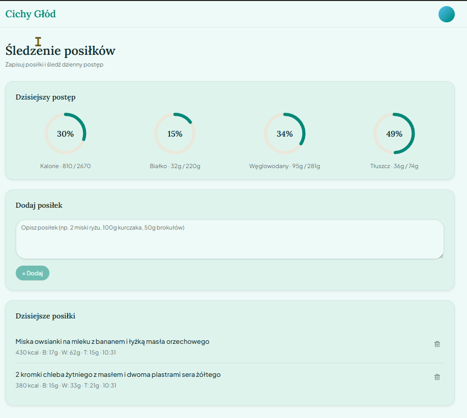

# Cichy Głód: jak zbudować (MVP) tracker kalorii z AI w Lovable

Instrukcja krok po kroku, jak zbudować prosty tracker kalorii i makroskładników w [Lovable](https://lovable.dev/invite/JO6JTO4), bez pisania kodu. Kluczowa funkcja: użytkownik opisuje posiłek zwykłym zdaniem ("2 miski ryżu, 100g kurczaka, 50g brokułów"), a AI szacuje kalorie i makroskładniki.

**Czas realizacji:** ~20–25 minut
**Wymagania:** Konto w Lovable (darmowe)
**Efekt końcowy:** Działająca aplikacja z bazą danych, obliczaniem celu kalorycznego, szacowaniem posiłków przez AI i wykresem tygodniowym

Layout, wzór na kalorie i prompt AI są dopracowane pod kątem realnej potrzeby: ktoś chce w kilka sekund zapisać, co zjadł, i widzieć, jak to się ma do dziennego celu, bez ręcznego liczenia kalorii w głowie czy w osobnym arkuszu.

> 💰 **To jest wersja MVP.** Typowe komercyjne trackery kalorii mają dużo więcej funkcji niż poniżej. Rzeczy, które celowo pominięto (i dlaczego) są opisane w sekcji [Poza MVP: co pominięto i dlaczego](#poza-mvp-co-pominięto-i-dlaczego) na końcu. Każdy krok, który kosztuje dodatkowe tokeny/kredyty przy każdym użyciu (nie tylko przy budowie), jest oznaczony 💰.



---

## Spis treści

1. [Krok 1: Layout i design](#krok-1-layout-i-design)
2. [Krok 2: Baza danych (bez logowania)](#krok-2-baza-danych-bez-logowania)
3. [Krok 3: Onboarding i obliczanie celu kalorycznego](#krok-3-onboarding-i-obliczanie-celu-kalorycznego)
4. [Krok 4: Dodawanie posiłku + AI 💰](#krok-4-dodawanie-posiłku--ai-)
5. [Krok 5: Usuwanie posiłków](#krok-5-usuwanie-posiłków)
6. [Krok 6: Strona Analiza](#krok-6-strona-analiza)
7. [Krok 7: Strona Ustawienia](#krok-7-strona-ustawienia)
8. [Krok 8 (opcjonalny): Historia posiłków i poprzednich tygodni (bez AI)](#krok-8-opcjonalny-historia-posiłków-i-poprzednich-tygodni-bez-ai)
9. [Krok 9 (opcjonalny): Wskazówki AI na dashboardzie 💰](#krok-9-opcjonalny-wskazówki-ai-na-dashboardzie-)
10. [Poza MVP: co pominięto i dlaczego](#poza-mvp-co-pominięto-i-dlaczego)
11. [Funkcjonalności aplikacji](#funkcjonalności-aplikacji)
12. [Dane testowe](#dane-testowe)

---

## Krok 1: Layout i design

**Co robimy:** Tworzymy finalny wygląd aplikacji: wszystkie strony i sekcje w docelowych miejscach, ale bez żadnej logiki. Puste stany wszędzie.

**Co można zmienić:**

- Kolory (`#0D9488` → dowolny inny kolor akcentowy)
- Fonty (`Plus Jakarta Sans`, `Lora` → inne z Google Fonts)
- Nazwę aplikacji ("Cichy Głód" → cokolwiek, np. angielski wariant "Honest Plate")

**Częste problemy Lovable:**

- ⚠️ Lovable może nie załadować fontów z Google Fonts, jeśli tekst wygląda na systemowy, wyślij: `"Fonty Plus Jakarta Sans i Lora nie działają, dodaj poprawny import z Google Fonts w pliku index.html"`
- ⚠️ shadcn/ui **nie ma** gotowego kołowego wskaźnika postępu (to znany brak w bibliotece), Lovable może spróbować użyć zwykłego paska zamiast pierścienia. Jeśli tak się stanie, wyślij: `"Pierścienie postępu w karcie 'Dzisiejszy postęp' muszą być kołowe (SVG, animowany stroke-dashoffset), nie liniowe paski"`
- ⚠️ Lovable może nie wyróżnić aktualnie otwartej strony w menu (wszystkie linki wyglądają tak samo), wyślij: `"Link do aktualnie otwartej strony w menu górnym ma być wyróżniony kolorem #0D9488 i podkreśleniem, pozostałe linki mają być szare"`

```
Zbuduj jednostronicową aplikację webową o nazwie "Cichy Głód",
prosty tracker kalorii i makroskładników. Na tym etapie tworzę
tylko wygląd i układ, bez funkcjonalności. Wszystkie sekcje
pokazują puste stany (zero danych). Aplikacja jest CAŁA po
polsku, bez przełącznika języka.

SYSTEM DESIGNU
- Jasny motyw, ciepła, minimalistyczna estetyka
- Tło: bardzo jasny miętowy (#F4FAF9), karty: #E8F5F2 z subtelnym
  borderem #D2E9E3
- Kolor akcentowy: turkusowy (#0D9488), drugorzędny: błękit
  (#38BDF8)
- Kolor przekroczenia celu (pierścienie postępu po 100%): #DC2626
- Font: Plus Jakarta Sans (Google Fonts) jako font ciała,
  Lora jako font nagłówków (logo, tytuły kart)
- Border radius: 20px na kartach, 12px na przyciskach/inputach
- Delikatne cienie: 0 2px 6px rgba(0,0,0,0.06)
- Responsywny, zoptymalizowany pod desktop (1280px+),
  poniżej 1024px: jedna kolumna
- Płynne przejścia 200ms ease na elementach interaktywnych
- Bez logowania/autoryzacji, aplikacja jednoosobowa,
  jak prywatny dziennik

HEADER (widoczny na każdej podstronie, pasek na całą szerokość)
- Lewo: "Cichy Głód" (font Lora, kolor #0D9488)
- Prawo: klasyczne, zawsze widoczne menu nawigacyjne: trzy
  linki tekstowe obok siebie, BEZ chowania ich pod ikoną czy
  dropdownem: "Śledzenie", "Analiza", "Ustawienia"
  Aktywna strona: kolor #0D9488 + podkreślenie (lub jasnoturkusowe
  tło #E8F5F2 pod linkiem)
  Nieaktywne linki: szary tekst, hover płynnie przechodzi w #0D9488

STRONA GŁÓWNA: ONBOARDING
(pokazywana tylko dopóki nie ma zapisanego profilu w bazie,
logikę przełączania dodamy w Kroku 2, teraz tylko wygląd)

Ekran 1/2: formularz:
- Nagłówek "Witaj!" (Lora, wyśrodkowany)
- Podtytuł "Ustawmy Twój plan żywieniowy" (szary, wyśrodkowany)
- Karta "Powiedz nam coś o sobie" (wyśrodkowana, max-width ~480px):
  - Pole "Wiek" (number input)
  - Pole "Wzrost (cm)" (number input)
  - Pole "Waga (kg)" (number input)
  - Pole "Cel" (dropdown: "Redukcja", "Utrzymanie wagi", "Masa")
  - Przycisk "Oblicz cele →" (pełna szerokość, #0D9488,
    białe litery, rounded 12px)

Ekran 2/2: wynik (statyczne "0" na razie):
- Ta sama karta, tytuł "Twój spersonalizowany plan":
  - "🎯 Cel kaloryczny (dziennie)": "0"
  - "🥩 Cel białka (g)": "0"
  - "🍞 Cel węglowodanów (g)": "0"
  - "🧈 Cel tłuszczu (g)": "0"
  - Dwa przyciski: "Wstecz" (outlined) i "Rozpocznij śledzenie"
    (#0D9488, pełny)

STRONA "ŚLEDZENIE" (główny dashboard, /sledzenie)
- Nagłówek "Śledzenie posiłków" + podtytuł "Zapisuj posiłki
  i śledź dzienny postęp"
- Karta "Dzisiejszy postęp": 4 kołowe pierścienie postępu
  w jednym wierszu: Kalorie, Białko, Węglowodany, Tłuszcz.
  Każdy: cienki pierścień SVG (tło jasnoturkusowe #E8F5F2,
  wypełnienie turkusowe #0D9488), pośrodku wartość procentowa, podpis
  pod pierścieniem. Wszystkie na "0%" na razie.
- Karta "Dodaj posiłek": pole tekstowe (4 wiersze) z
  placeholderem "Opisz posiłek (np. 2 miski ryżu, 100g kurczaka,
  50g brokułów)", przycisk "+ Dodaj" (#0D9488), na razie
  nieaktywny, tylko wygląd
- Karta "Dzisiejsze posiłki": pusty stan, ikona "+" w kółku,
  tekst "Brak zapisanych posiłków", podtekst "Zacznij śledzić,
  dodając pierwszy posiłek powyżej"

STRONA "ANALIZA" (/analiza)
- Nagłówek "Analiza" + podtytuł "Zobacz trendy w Twojej diecie"
- Karta "Tygodniowe spożycie kalorii": pełna szerokość,
  miejsce na wykres słupkowy (dodamy w Kroku 6). Pusty stan:
  "Brak danych z tego tygodnia"
- Trzy karty w jednym wierszu: "Białko", "Węglowodany", "Tłuszcz",
  każda pokazuje dużą liczbę "0g" i podpis "Średnia dzienna"
- Karta "Podsumowanie tygodnia": trzy wiersze:
  "Średnie dzienne kalorie", "Dni w celu", "Najlepszy dzień",
  wszystkie "—" na razie

STRONA "USTAWIENIA" (/ustawienia)
- Nagłówek "Ustawienia" + podtytuł "Zarządzaj swoim profilem
  i celami"
- Karta "Dane osobowe": pola Wiek, Wzrost (cm), Waga (kg), Cel
  (dropdown: "Redukcja", "Utrzymanie wagi", "Masa"), pod polami
  przycisk drugorzędny (outlined) "Przelicz z formuły"
- Karta "Cele żywieniowe": pola Kalorie dzienne, Białko (g),
  Węglowodany (g), Tłuszcz (g), każde z małym podpisem
  pomocniczym pod polem (np. "Docelowe kalorie dziennie")
- Przycisk "Zapisz zmiany" (#0D9488)

Stack: React + TypeScript + Vite, Tailwind CSS, Recharts
```

---

## Krok 2: Baza danych (bez logowania)

**Co robimy:** Dodajemy bazę danych, żeby profil i posiłki nie znikały po odświeżeniu. Aplikacja jest **jednoosobowa**: bez logowania, tak jak "Coin Sage" z `aplikacja-budzet-domowy-przewodnik.md`. To świadoma decyzja MVP: logowanie multi-user (Supabase Auth + RLS per użytkownik) to sensowny dodatek TYLKO jeśli więcej niż jedna osoba ma korzystać z tej samej aplikacji, patrz [Poza MVP](#poza-mvp-co-pominięto-i-dlaczego).

**Częste problemy Lovable:**

- ⚠️ Lovable może poprosić o ręczne połączenie Supabase, kliknij "Connect Supabase" i postępuj zgodnie z instrukcjami
- ⚠️ Ostrzeżenia o bezpieczeństwie RLS: normalne, celowo ustawiamy otwartą politykę (prywatna, jednoosobowa aplikacja)

> ⚠️ **Bezpieczeństwo:** Otwarta RLS jest OK **tylko dla prywatnej aplikacji jednego użytkownika**. Zanim opublikujesz aplikację dla innych, najpierw dodaj logowanie i zamknij RLS (wzorzec dokładnie taki jak w Kroku 2 `biztrack-webinar-przewodnik.md`).

```
Dodaj integrację z Supabase, żeby profil i posiłki były
zapisywane w bazie danych.

1. Stwórz tabelę "profile" (przechowuje JEDEN wiersz: ustawienia
   jedynego użytkownika aplikacji):
   - id (uuid, primary key, default gen_random_uuid())
   - age (integer)
   - height_cm (numeric)
   - weight_kg (numeric)
   - goal (text, CHECK IN ('lose', 'maintain', 'gain'))
   - daily_calories (numeric)
   - daily_protein (numeric)
   - daily_carbs (numeric)
   - daily_fat (numeric)
   - updated_at (timestamp, domyślnie now())

2. Stwórz tabelę "meals":
   - id (uuid, primary key, default gen_random_uuid())
   - description (text)
   - calories (numeric)
   - protein (numeric)
   - carbs (numeric)
   - fat (numeric)
   - logged_at (timestamp, domyślnie now())

3. Przy starcie aplikacji sprawdź, czy istnieje wiersz w "profile":
   - Jeśli NIE ma żadnego wiersza: pokaż ekran onboardingu
   - Jeśli JEST: pomiń onboarding, przejdź od razu na stronę
     "Śledzenie", wczytaj cele z profilu i posiłki z dzisiejszego
     dnia (filtruj po lokalnej dacie użytkownika, nie UTC,
     inaczej posiłek dodany wieczorem "zniknie" po północy UTC)

4. Aplikacja jest prywatna, jeden użytkownik, bez autoryzacji,
   otwarta polityka RLS (public anon key)
```

---

## Krok 3: Onboarding i obliczanie celu kalorycznego

**Co robimy:** Aktywujemy formularz onboardingu. Obliczenie celu kalorycznego to **czysta matematyka wykonywana w kodzie aplikacji, bez wywołania AI**, więc ten krok nic nie kosztuje przy każdym użyciu (w przeciwieństwie do Kroku 4).

**Co można zmienić:**

- Mnożnik aktywności (`1.55`): MVP zakłada na sztywno "aktywność umiarkowaną" i nie pyta o poziom aktywności ani płeć. To celowe uproszczenie: mniej pól w onboardingu = mniejszy próg wejścia dla nowego użytkownika, kosztem dokładności szacunku. Jeśli chcesz dokładniejszy wynik, dodaj pole "Płeć" (formuła Mifflin-St Jeor różni się o stałą: +5 dla mężczyzn, −161 dla kobiet) i "Poziom aktywności" (dropdown z mnożnikami 1.2–1.9)
- Deficyt/nadwyżka kaloryczna (`−500` / `+400`): standardowe wartości, można dostosować

**Częste problemy Lovable:**

- ⚠️ Jeśli wyniki wyglądają nierealistycznie (np. ujemne wartości węglowodanów przy bardzo niskim celu kalorycznym), wyślij: `"Dodaj dolny limit: cel kaloryczny nie może być niższy niż 1200 kcal, węglowodany nie mogą wyjść poniżej 0"`

```
Aktywuj formularz onboardingu z Kroku 1 razem z logiką obliczeń:

1. Po kliknięciu "Oblicz cele →" oblicz w kodzie aplikacji
   (BEZ wywołania AI, to zwykła matematyka):

   BMR (wzór Mifflin-St Jeor, wariant uśredniony, bez pytania
   o płeć):
   BMR = 10 × waga_kg + 6.25 × wzrost_cm − 5 × wiek + 5

   TDEE (założenie: aktywność umiarkowana, stała wartość w MVP):
   TDEE = BMR × 1.55

   Cel kaloryczny zależnie od wybranego pola "Cel":
   - "Redukcja" → TDEE − 500
   - "Utrzymanie wagi" → TDEE
   - "Masa" → TDEE + 400

   Makroskładniki (na bazie celu kalorycznego):
   - Białko (g) = waga_kg × 2
   - Tłuszcz (g) = (cel_kaloryczny × 0.25) / 9
   - Węglowodany (g) = (cel_kaloryczny − białko × 4 − tłuszcz × 9) / 4

   Wszystkie wyniki zaokrąglij do liczb całkowitych.

2. Pokaż wyliczone wartości na ekranie 2/2 onboardingu
   ("Twój spersonalizowany plan")

3. Po kliknięciu "Rozpocznij śledzenie" zapisz nowy wiersz do
   tabeli "profile" (wiek, wzrost, waga, cel, 4 wyliczone cele)
   i przekieruj na stronę "Śledzenie"

4. Przycisk "Wstecz" wraca do formularza bez utraty wpisanych
   wcześniej danych
```

---

## Krok 4: Dodawanie posiłku + AI 💰

**Co robimy:** Aktywujemy przycisk "+ Dodaj": wpisany opis posiłku trafia do AI, które szacuje kalorie i makroskładniki, a wynik zapisuje się w bazie.

> 💰 **Koszt:** każde dodanie posiłku to jedno wywołanie AI. Prompt i odpowiedź są krótkie, więc przy typowym użyciu (kilka posiłków dziennie) koszt jest niewielki, ale nie zerowy, w przeciwieństwie do Kroków 3, 5, 6 i 7, które nic nie kosztują. Jeśli zależy Ci na zerowym koszcie operacyjnym, alternatywą jest zamiana pola tekstowego na zwykłe pola liczbowe (kalorie/białko/węglowodany/tłuszcz wpisywane ręcznie), prostsze i szybsze w budowie, ale mniej wygodne w użyciu.

### ⚡ Wymagane: Włączenie Lovable Cloud

Tak samo jak w Coin Sage: `LOVABLE_API_KEY` pojawia się dopiero po włączeniu Lovable Cloud. Wyślij prompt poniżej, Lovable wykryje potrzebę backendu i włączy Cloud samodzielnie (albo ręcznie: ikona **Cloud** w górnym pasku → **Secrets** → sprawdź czy `LOVABLE_API_KEY` istnieje).

**Częste problemy Lovable:**

- ⚠️ Lovable może zaproponować własny klucz OpenAI w przeglądarce, **odmów**, poproś o Lovable Cloud
- ⚠️ AI może zwrócić JSON owinięty w ```` ```json ````, dopisz do promptu wprost zakaz code fence (już jest w prompcie poniżej), a jeśli mimo to się pojawi, wyślij: `"Odpowiedź AI czasem zawiera znaczniki markdown wokół JSON, dodaj parsowanie, które je usuwa przed JSON.parse"`
- ⚠️ Modal/pole tekstowe może nie czyścić się po dodaniu, wyślij: `"Pole tekstowe 'Opisz posiłek' nie czyści się po kliknięciu Dodaj, wyczyść je po sukcesie"`
- ⚠️ Błąd 429 (rate limit) lub 402 (brak kredytów): obsłuż komunikatem toast, nie crashem
- ⚠️ Pierścienie postępu mogą zatrzymać się na 100% i zostać turkusowe nawet po przekroczeniu celu (widać to np. przy 2733/2670 kcal), jeśli tak się stanie, wyślij: `"Gdy wartość przekracza 100% celu, pierścień postępu ma zmienić kolor na czerwony (#DC2626) zamiast zostawać turkusowy, dotyczy wszystkich 4 pierścieni w karcie 'Dzisiejszy postęp'"`

```
Aktywuj przycisk "+ Dodaj" w karcie "Dodaj posiłek":

1. Kliknięcie wysyła treść pola tekstowego do AI, a wynik
   zapisuje w bazie i czyści pole

2. Włącz Lovable Cloud i stwórz edge function "analyze-meal":
   - Odbiera opis posiłku (tekst po polsku)
   - Prompt systemowy: "Jesteś dietetykiem szacującym wartości
     odżywcze posiłków na podstawie opisu tekstowego w języku
     polskim. Otrzymasz opis całego posiłku, może zawierać
     kilka składników (np. '2 miski ryżu, 100g kurczaka,
     50g brokułów'). Oszacuj SUMĘ kalorii i makroskładników dla
     CAŁEGO opisanego posiłku.
     Zasady:
     - Szacuj konserwatywnie: przy niepewności wybierz wartość
       bliższą przeciętnej porcji, nie maksymalnej.
     - Jeśli brak podanej ilości składnika, przyjmij typową
       porcję dla tego składnika.
     - Zwróć WYŁĄCZNIE surowy JSON, bez bloków kodu (bez ```),
       bez żadnego dodatkowego tekstu, w formacie:
       {"calories": liczba, "protein": liczba, "carbs": liczba,
       "fat": liczba}
     - Wartości liczbowe bez jednostek (protein/carbs/fat w
       gramach, calories w kcal)."
   - Temperature: niska (0.2–0.3), zależy nam na powtarzalności,
     nie kreatywności
   - Klucz API wyłącznie po stronie serwera

3. Po odpowiedzi zapisz wiersz do tabeli "meals" (opis + 4
   wyliczone wartości) z logged_at = teraz

4. Po zapisie odśwież: 4 pierścienie postępu w karcie
   "Dzisiejszy postęp" (suma dzisiejszych posiłków / cel dzienny
   z profilu, zaokrąglone do %) oraz listę "Dzisiejsze posiłki"
   (nowy wiersz na górze: opis, kalorie, "B: Xg · W: Yg · T: Zg",
   ikona kosza)

   Przekroczenie celu: gdy suma > 100% celu, wypełnienie pierścienia
   zatrzymuje się na pełnym okręgu (nie da się narysować więcej niż
   100% obwodu), ale zmienia kolor z turkusowego (#0D9488) na
   czerwony (#DC2626), to jedyny sygnał przekroczenia, bo liczba
   procentowa w środku pierścienia i tak pokazuje realną wartość
   (np. "102%"), nie ograniczoną do 100

5. Przycisk "+ Dodaj" zablokowany podczas analizy (stan loading,
   np. spinner zamiast tekstu)

6. Obsługa błędów: rate limit (429) i brak kredytów (402):
   komunikaty toast, pole tekstowe NIE czyści się przy błędzie
   (użytkownik nie traci wpisanego opisu)
```

---

## Krok 5: Usuwanie posiłków

**Co robimy:** Dodajemy możliwość usunięcia błędnie dodanego posiłku. Prosta operacja bez AI: zero kosztu.

> 💡 **Sprawdź najpierw, zanim wyślesz prompt.** Lovable dość często dorzuca ikonę kosza przy liście posiłków samo, przy okazji budowania Kroku 4 (traktuje to jako oczywisty element listy z elementami do usunięcia). Jeśli usuwanie już działa, pomiń ten krok, nie wysyłaj prompta na siłę (to tylko zużyje kredyty na coś, co już istnieje). Wyślij go tylko, jeśli przycisku faktycznie brakuje albo usuwanie nie działa poprawnie.

```
Dodaj ikonę kosza (trash) na końcu każdego wiersza w karcie
"Dzisiejsze posiłki":
- Kliknięcie usuwa posiłek z tabeli "meals" (DELETE po id)
- Po usunięciu odśwież pierścienie postępu na "Dzisiejszy postęp"
  oraz listę posiłków
- Bez okna potwierdzenia: MVP, niska stawka błędu przy krótkiej
  liście. Jeśli wolisz zabezpieczenie przed przypadkowym
  usunięciem, dodaj AlertDialog (shadcn/ui) z pytaniem "Czy na
  pewno chcesz usunąć ten posiłek?", dokładnie ten sam wzorzec,
  co w Kroku 5 biztrack-webinar-przewodnik.md
```

---

## Krok 6: Strona Analiza

**Co robimy:** Wypełniamy stronę "Analiza" prawdziwymi danymi z tabeli `meals`. Wszystko liczone w kodzie na już pobranych danych, bez wywołań AI, zero kosztu operacyjnego.

**Częste problemy Lovable:**

- ⚠️ Wykres może liczyć tydzień od niedzieli zamiast poniedziałku, jeśli chcesz inaczej, wyślij: `"Tydzień na wykresie 'Tygodniowe spożycie kalorii' ma zaczynać się od poniedziałku, nie od niedzieli"`
- ⚠️ Średnia dzienna makroskładników może dzielić przez 7 nawet gdy tydzień się jeszcze nie skończył, to zaniża wynik, popraw jak w prompcie poniżej
- ⚠️ "Dni w celu" może liczyć dzień jako "w celu" mimo wyraźnego przekroczenia (np. 3050 kcal przy celu 2670 kcal, czyli +14%), to znak, że Lovable sprawdził tylko dolną granicę (czy najadłeś się wystarczająco), a pominął górną (czy nie przejadłeś się). Wyślij: `"'Dni w celu' liczy dzień jako w celu nawet po sporym przekroczeniu, popraw warunek na dwustronny: |suma_dnia − cel| / cel <= 0.10, obie strony (i niedobór, i nadwyżka) mają się liczyć jako poza celem"`
- ⚠️ Pierścienie postępu na stronie "Śledzenie" mogą przestać się aktualizować po zbudowaniu tego kroku, Lovable czasem nadpisuje albo odłącza wspólną logikę pobierania dzisiejszych posiłków przy okazji budowania strony Analiza. Wyślij: `"Pierścienie postępu w karcie 'Dzisiejszy postęp' na stronie 'Śledzenie' przestały się aktualizować po dodaniu lub usunięciu posiłku, sprawdź czy logika pobierania i sumowania dzisiejszych posiłków dla tych pierścieni nie została nadpisana albo odłączona przy budowaniu strony Analiza, i napraw, żeby znowu przeliczały się natychmiast po każdej zmianie w tabeli 'meals'"`

```
Wypełnij stronę "Analiza" danymi z tabeli "meals":

1. Wykres "Tygodniowe spożycie kalorii":
   - Pobierz posiłki z bieżącego tygodnia (poniedziałek–niedziela,
     wg lokalnej daty), zsumuj kalorie per dzień
   - BarChart (Recharts), NIE LineChart: dane dzienne są
     dyskretne (jedna wartość na dzień), gładka krzywa
     sugerowałaby nieistniejące wartości pomiędzy dniami.
     Słupki koloru #0D9488, oś X: dni tygodnia (Pon–Ndz),
     oś Y: kcal. Dzień bez posiłków = słupek na wysokości 0
     (odróżnialny od braku danych)
   - Przerywana pozioma linia (ReferenceLine) na wysokości celu
     kalorycznego z profilu (referencja, żeby widzieć przekroczenia)
   - Pusty stan: "Brak danych z tego tygodnia"

2. Trzy karty makroskładników (Białko/Węglowodany/Tłuszcz):
   średnia dzienna = suma z bieżącego tygodnia / liczba dni,
   w których był choć jeden posiłek (NIE dziel przez 7, jeśli
   tydzień się jeszcze nie skończył, to zaniżałoby wynik)

3. Karta "Podsumowanie tygodnia":
   - "Średnie dzienne kalorie": jak wyżej, tylko dla kalorii
   - "Dni w celu": dla KAŻDEGO dnia bieżącego tygodnia (również
     dnia bez posiłków, gdzie suma = 0) oblicz:
     odchylenie = |suma_dnia − cel_kaloryczny| / cel_kaloryczny
     Dzień liczy się jako "w celu" TYLKO gdy odchylenie <= 0.10.
     To warunek DWUSTRONNY: liczy się zarówno za duży niedobór
     (zjadłeś za mało), jak i za duża nadwyżka (przekroczyłeś cel).
     Jedno bez drugiego to błąd. Dzień z sumą = 0 nigdy nie
     spełnia warunku (odchylenie = 100%). Policz dni spełniające
     warunek, pokaż jako "X/7"
   - "Najlepszy dzień": dzień tygodnia z sumą kalorii najbliższą
     celowi (najmniejsza wartość odchylenia z wzoru wyżej,
     niezależnie od tego czy dzień jest "w celu")
```

---

## Krok 7: Strona Ustawienia

**Co robimy:** Aktywujemy edycję profilu: użytkownik może ręcznie poprawić wyliczone w Kroku 3 cele (wzór jest tylko punktem startowym, nie wyrocznią), albo poprawić wiek/cel i przeliczyć cele od nowa tą samą formułą co przy onboardingu, np. gdy zmienił się cel albo minął rok.

**Częste problemy Lovable:**

- ⚠️ Przycisk "Przelicz z formuły" może od razu zapisywać wynik do bazy zamiast tylko wypełnić pola formularza, wyślij: `"Przycisk 'Przelicz z formuły' ma tylko wypełnić pola Kalorie/Białko/Węglowodany/Tłuszcz w formularzu, NIE zapisywać nic do bazy, dopóki nie kliknę 'Zapisz zmiany'"`

```
Aktywuj stronę "Ustawienia":

1. Przy wejściu na stronę wczytaj aktualny wiersz z tabeli
   "profile" do formularza (wszystkie 8 pól: wiek, wzrost, waga,
   cel, 4 wyliczone cele)

2. Pola: Wiek, Wzrost (cm), Waga (kg), Cel, Kalorie dzienne,
   Białko (g), Węglowodany (g), Tłuszcz (g), wszystkie edytowalne
   ręcznie (użytkownik może nadpisać wyliczone wartości, np. gdy
   zna swoje realne zapotrzebowanie lepiej niż uproszczony wzór
   z Kroku 3)

3. Przycisk "Przelicz z formuły" (BEZ wywołania AI, ta sama
   matematyka co w Kroku 3):
   - Bierze aktualne wartości z pól Wiek, Wzrost, Waga, Cel
     (te z formularza, NIE zapisane wcześniej w bazie, żeby
     przeliczenie uwzględniało niezapisane jeszcze zmiany)
   - Liczy BMR, TDEE i cel kaloryczny + makroskładniki dokładnie
     tym samym wzorem co w Kroku 3
   - Wypełnia pola Kalorie dzienne, Białko, Węglowodany, Tłuszcz
     nowymi wartościami w formularzu, NIE zapisuje ich jeszcze
     do bazy, użytkownik widzi wynik i może go ręcznie poprawić
     przed kliknięciem "Zapisz zmiany"

4. Przycisk "Zapisz zmiany": aktualizuje istniejący wiersz
   w "profile" (UPDATE po id, NIE tworzy nowego wiersza,
   w tabeli zawsze jest dokładnie jeden wiersz), zapisuje
   wszystkie 8 pól z formularza, niezależnie czy zostały
   przeliczone przyciskiem czy wpisane ręcznie

5. Po zapisie: toast "✓ Zmiany zapisane". Pierścienie postępu
   i wykresy na stronach "Śledzenie" i "Analiza" mają używać
   nowych celów od razu (bez konieczności odświeżania strony)
```

---

## Krok 8 (opcjonalny): Historia posiłków i poprzednich tygodni (bez AI)

**Co robimy:** Rozszerzamy stronę "Analiza" o nawigację po tygodniach (jak strzałki ◀ ▶ w BizTracku) i podgląd posiłków z konkretnego dnia po kliknięciu słupka na wykresie. Całość liczona z danych już w Supabase: **zero wywołań AI, zero kosztu operacyjnego**, mimo że to krok opcjonalny.

> 💡 **Dlaczego to w ogóle jest tu potrzebne.** Dane z każdego posiłku zostają w tabeli `meals` na zawsze, nic nie jest kasowane. Problem w tym, że bez tego kroku nie ma jak ich zobaczyć: strona "Śledzenie" pokazuje tylko dzisiejsze posiłki, a "Analiza" tylko bieżący tydzień. Jeśli wykres pokaże nietypowy dzień (np. duży skok kalorii), bez tego kroku nie sprawdzisz, co dokładnie wtedy zjadłeś, ani nie zobaczysz podsumowania sprzed tygodnia.
>
> **Zrób ten krok przed Krokiem 9, jeśli oszczędzasz kredyty (darmowe konto Lovable).** Ten krok nie wywołuje AI ani razu, a daje więcej realnej wartości niż wskazówki tekstowe z Kroku 9, dlatego celowo stoi tu, wcześniej.

**Częste problemy Lovable:**

- ⚠️ Strzałka "następny tydzień" może nie być zablokowana na bieżącym tygodniu, analogicznie do Kroku 4 nawigacji po miesiącach w `biztrack-webinar-przewodnik.md`, wyślij: `"Strzałka 'następny tydzień' ma być zablokowana, gdy jestem już na bieżącym tygodniu"`
- ⚠️ Panel z posiłkami danego dnia może pokazać dane z sąsiedniego dnia (przesunięcie o dobę), to ten sam problem stref czasowych co w Kroku 2, sprawdź czy filtrowanie jest po lokalnej dacie, nie UTC

```
Rozszerz stronę "Analiza" o przeglądanie historii, BEZ wywołań
AI, wyłącznie zapytania do Supabase:

1. NAWIGACJA PO TYGODNIACH
   W nagłówku karty "Tygodniowe spożycie kalorii" dodaj strzałki
   ◀ ▶ obok tytułu:
   - Domyślnie: bieżący tydzień
   - Lewa strzałka: poprzedni tydzień
   - Prawa strzałka: następny tydzień (zablokowana, gdy jesteś
     już na bieżącym tygodniu)
   - Nad wykresem pokaż zakres dat wybranego tygodnia
     (np. "27 kwietnia – 3 maja")
   - WSZYSTKIE dane na stronie "Analiza" (wykres, 3 karty makro,
     "Podsumowanie tygodnia") filtrują się do wybranego tygodnia,
     nie tylko wykres

2. POSIŁKI Z KONKRETNEGO DNIA
   Kliknięcie słupka na wykresie otwiera panel boczny (komponent
   Sheet z shadcn/ui) z listą posiłków tego dnia:
   - Tytuł panelu: pełna data (np. "Wtorek, 29 kwietnia")
   - Lista posiłków w tym samym formacie co "Dzisiejsze posiłki"
     na stronie "Śledzenie" (opis, kalorie, "B: Xg · W: Yg · T: Zg"),
     BEZ ikony kosza: to widok tylko do odczytu, usuwanie zostaje
     wyłącznie na stronie "Śledzenie" dla dzisiejszego dnia
   - Dzień bez posiłków: "Brak posiłków tego dnia"
   - Zamknięcie: X w rogu panelu lub kliknięcie poza nim

3. Zmiana tygodnia strzałkami zamyka otwarty panel dnia,
   jeśli był otwarty
```

---

## Krok 9 (opcjonalny): Wskazówki AI na dashboardzie 💰

> 💰 **Krok opcjonalny: pomiń, jeśli chcesz zaoszczędzić kredyty.** To najbardziej "kosztowny" element całej aplikacji: każda zmiana w liście dzisiejszych posiłków (dodanie LUB usunięcie) wywołuje dodatkowe zapytanie do AI, niezależne od Kroku 4. Dla apki używanej codziennie przez jedną osobę to wciąż niewielki koszt, ale jest w 100% opcjonalny, reszta aplikacji (Kroki 1–7, czyli wszystko poza dwoma opcjonalnymi dodatkami) działa kompletnie bez niego.
>
> Jeśli już zrobiłeś (darmowy) Krok 8, ten krok jest ostatnim, prawdziwie opcjonalnym dodatkiem, spokojnie możesz go pominąć całkowicie.

**Co robimy:** Dodajemy kartę z krótkimi wskazówkami AI na stronie "Śledzenie", generowaną na bazie dzisiejszych posiłków i celów.

```
Dodaj nową kartę "Wskazówki AI" na stronie "Śledzenie" (pod
kartą "Dzisiejsze posiłki"), gradientowy lewy border
#38BDF8 → #0D9488:

1. Stwórz edge function "meal-insights":
   - Wywoływana automatycznie po każdej zmianie dzisiejszych
     posiłków (dodanie lub usunięcie)
   - Jeśli lista dzisiejszych posiłków jest pusta, NIE wywołuj,
     zostaw pusty stan "Dodaj posiłek, aby zobaczyć wskazówki"
   - Przyjmuje: dzisiejsze posiłki (suma kalorii/białka/węgli/
     tłuszczu) + cele z profilu
   - Prompt systemowy: "Jesteś asystentem żywieniowym. Porównaj
     dzisiejsze spożycie z celami użytkownika i zwróć dokładnie
     2 krótkie wskazówki po polsku. Każda wskazówka to jedna
     linia zaczynająca się od emoji, np.:
     💪 Zostało Ci jeszcze 45g białka do dziennego celu
     ⚠️ Masz już 2100 z 2700 kcal, zostało niewiele miejsca
     Zasady: tylko 2 linie, żadnego markdown (bez *, #), żadnych
     nagłówków ani komentarzy, wyłącznie 2 linie z emoji.
     Używaj konkretnych liczb z danych."
   - Klucz API wyłącznie po stronie serwera

2. Wynik w karcie jako zwykły tekst (2 linie)
3. Podczas generowania: skeleton loader (animowane linie)
4. Po błędzie: "Wskazówki niedostępne, spróbuj ponownie."
```

---

## Poza MVP: co pominięto i dlaczego

| Funkcja | Dlaczego pominięta w MVP |
|---|---|
| **Logowanie wieloosobowe** (Supabase Auth + RLS per user) | Potrzebne TYLKO jeśli więcej niż jedna osoba ma korzystać z tej samej aplikacji. Dodanie to powtórka Kroku 2 z `biztrack-webinar-przewodnik.md` (auth + `user_id = auth.uid()` w politykach RLS). Dla osobistego użytku: niepotrzebny koszt złożoności. |
| **Rozpoznawanie posiłku ze zdjęcia** | Wymaga modelu wizyjnego (droższe zapytania, więcej tokenów) i obsługi uploadu/przechowywania zdjęć. Większość użytkowników i tak opisze posiłek tekstem szybciej, niż zrobi zdjęcie i poczeka na analizę. Realny koszt wdrożenia nieproporcjonalny do korzyści w wersji MVP. |
| **Przełącznik języka EN/PL (i18n)** | Aplikacja ma być tylko po polsku. i18n (jak w Coin Sage) ma sens tylko gdy faktycznie potrzebujesz dwujęzyczności, tu dodałoby złożoność bez korzyści. |
| **Edycja istniejącego posiłku** (zamiast tylko dodaj/usuń) | Rzadko używana, przy krótkim opisie łatwiej usunąć i dodać ponownie niż otwierać modal edycji. Jeśli chcesz, wzorzec do skopiowania jest w Kroku 5 `aplikacja-budzet-domowy-przewodnik.md`. |
| **Nawigacja po dniach wstecz na stronie "Śledzenie"** (osobna od Kroku 8) | Krok 8 daje wgląd w historię przez stronę "Analiza" (kliknięcie słupka + strzałki po tygodniach), to wystarcza do przejrzenia przeszłości. Dodatkowa, osobna nawigacja po dniach na "Śledzenie" byłaby dublowaniem tej samej funkcji w drugim miejscu. |
| **Integracja z krokomierzem/treningiem** (Google Fit, Apple Health) | Wymaga zewnętrznego API i osobnej autoryzacji OAuth, całkowicie poza zakresem tego przewodnika (bliżej tematu z `polaczenie-google-bez-wygasania-przewodnik.md`, ale dla innego API). |

---

## Funkcjonalności aplikacji

| Funkcja | Opis |
|---|---|
| 🎨 Design | Ciepły, minimalistyczny interfejs, responsywny |
| 💾 Baza danych | Supabase, profil i posiłki nie znikają po odświeżeniu |
| 🧮 Kalkulator celu | Wzór Mifflin-St Jeor liczony w kodzie, bez AI |
| 🤖 AI | Lovable Cloud szacuje kalorie/makro z opisu posiłku |
| 📊 Wykres | Tygodniowe spożycie kalorii (Recharts, słupki + linia celu) |
| ⭕ Pierścienie postępu | 4 kołowe wskaźniki dziennego postępu, czerwone po przekroczeniu |
| 🗑️ Usuwanie | Kasowanie błędnie dodanych posiłków |
| 🗓️ Historia (opcjonalna, bez AI) | Nawigacja po tygodniach + podgląd posiłków z wybranego dnia |
| ⚙️ Ustawienia | Ręczna korekta wyliczonych celów |
| 💡 Wskazówki AI | Opcjonalne, krótkie podpowiedzi na dashboardzie |

---

## Dane testowe

Wklej pojedynczo do pola "Opisz posiłek" w karcie "Dodaj posiłek", żeby sprawdzić czy AI sensownie szacuje wartości i czy pierścienie/wykres się aktualizują:

```
2 kromki chleba żytniego z masłem i dwoma plastrami sera żółtego
```

```
Miska owsianki na mleku z bananem i łyżką masła orzechowego
```

```
200g piersi z kurczaka grillowanej, 150g ryżu, sałatka z pomidorów i ogórka z oliwą
```

```
Kawałek pizzy pepperoni (2 kawałki) i puszka coli
```

```
Jogurt naturalny 200g z garścią borówek i łyżeczką miodu
```

### Wskazówki ogólne

- **Testuj po każdym kroku**: nie wysyłaj następnego prompta zanim nie sprawdzisz, czy poprzedni działa
- **Zacznij od Kroku 1–3 bez AI**, sprawdź czy formularz, baza i obliczenia działają, dopiero potem przejdź do Kroku 4 (AI), łatwiej wtedy odróżnić błąd w logice od błędu w odpowiedzi AI
- **Zrzuty ekranu pomagają**: jeśli coś wygląda źle, załącz screenshot do następnego prompta
- **Grupuj drobne poprawki** w jeden prompt zamiast wysyłać je pojedynczo, oszczędza kredyty

---

## Autor

**Adam Kopeć**: [friendlyai.pl](https://www.friendlyai.pl/) · [YouTube](https://www.youtube.com/@Friendly_AI_PL) · [adam@friendlyai.pl](mailto:adam@friendlyai.pl)
