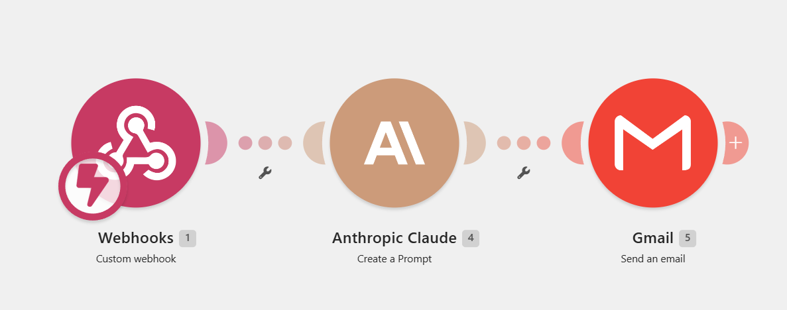

# Make.com: automatyczny mail po wypełnieniu formularza (Webhook → Claude → Gmail)

Prosta automatyzacja: użytkownik wypełnia formularz Google, a w kilka sekund dostaje spersonalizowanego maila napisanego przez AI. Schemat scenariusza:

```
Formularz Google  →  (Apps Script)  →  Webhook (Make)  →  Anthropic Claude  →  Gmail
```



**Efekt:** ⚡ natychmiastowy, spersonalizowany mail powitalny na adres podany w ankiecie.
**Demo:** 📊 krótka ankieta o Excelu (mail + 2 pytania).

**Narzędzia, które otworzysz:** [Make](https://www.make.com/) · [Google Apps Script](https://script.google.com/) · [Google Forms](https://forms.google.com/) · [konsola Anthropic](https://console.anthropic.com/settings/keys)

---

## 🗺️ Kolejność budowy (i dlaczego taka)

1. **Webhook w Make najpierw**: bo potrzebujesz jego URL, zanim napiszesz skrypt.
2. **Formularz + Apps Script**: skrypt tworzy formularz i po każdym wysłaniu wysyła dane na webhook.
3. **Moduł Claude**: generuje treść maila z odpowiedzi.
4. **Gmail**: wysyła maila na adres z formularza.

> AI występuje tu w dwóch rolach: (a) w czacie pomaga wygenerować kod Apps Scriptu na etapie przygotowania, (b) jako moduł w Make pisze treść maila w trakcie działania. To dwie różne rzeczy.

---

## Krok 1: 🔗 Webhook w Make

1. Zaloguj się w [Make](https://www.make.com/) → utwórz **nowy scenariusz** → dodaj moduł **Webhooks → Custom webhook** → **Add** → nazwij (np. „Excel ankieta").
2. **Skopiuj URL** webhooka. 📋 Zostaw moduł „Waiting for data".

Ten URL wklejasz w Kroku 2 do skryptu.

---

## Krok 2: 📝 Formularz Google przez Apps Script

> 📌 **Dwie funkcje, dwa miejsca (to ważne):**
> - **Funkcja tworząca formularz** (u nas `createExcelForm`): uruchamiasz **raz** w skrypcie **standalone** ([script.google.com](https://script.google.com/)). To ona różni się zależnie od formularza.
> - **`onFormSubmit`**: **uniwersalna**, wklejasz w skrypcie **samego formularza** (⋮ → Apps Script) i podpinasz pod wyzwalacz. Ta sama dla każdego formularza.
>
> Standalone tworzy formularz, ale nie jest z nim „spięty", więc wyzwalacz „Z formularza" dodajesz z poziomu formularza.

Formularz robimy w dwóch częściach: **Część 1**, funkcja tworząca formularz (tu masz dwa warianty: gotowy kod albo generowanie przez AI), i **Część 2**, uniwersalna funkcja `onFormSubmit`, na której oba warianty się spotykają.

### Część 1: funkcja tworząca formularz

Wejdź na [script.google.com](https://script.google.com/) → **Nowy projekt**. Kod tworzący formularz zdobędziesz na dwa sposoby:

#### Wariant A: gotowy, sprawdzony kod (używamy go w tym przykładzie) ✅

Wklej kod poniżej, wybierz funkcję **createExcelForm** i **Uruchom**. W logach 📄 znajdziesz link do formularza.

> ⚠️ **Pierwsze uruchomienie: autoryzacja Google (to normalne).** Skrypt tworzy formularz i łączy się na zewnątrz, więc Google poprosi o zgodę. Przejdź to do końca:
> 1. Okno **„Wymagana autoryzacja"** → **„Przejrzyj uprawnienia"**.
> 2. 👤 Wybierz swoje konto Google (być może trzeba będzie **zalogować się ponownie**, żeby potwierdzić zgody).
> 3. Ekran **„Ta aplikacja nie została zweryfikowana przez Google"** → **„Zaawansowane"** → **„Otwórz: Projekt bez nazwy (niebezpieczne)"**. 🔒 To bezpieczne: deweloperem tego skryptu jesteś **Ty sam** (Twój adres widnieje na ekranie). Ostrzeżenie pojawia się dla każdego prywatnego, niezweryfikowanego skryptu.
> 4. ✅ **„Zezwól"** na uprawnienia (tworzenie formularzy + łączenie z usługą zewnętrzną = webhook).
>
> 💡 Zaloguj się **tylko na jednym koncie Google** (albo użyj okna incognito): przy wielu kontach autoryzacja lubi się mylić i wraca do punktu wyjścia.

```javascript
function createExcelForm() {
  var form = FormApp.create('Excel — czego chcesz się nauczyć?');
  form.setDescription('Krótka ankieta (30 sekund). Na podany adres wyślemy materiały dopasowane do Twoich odpowiedzi.');
  form.setProgressBar(false);

  var emailValidation = FormApp.createTextValidation()
    .setHelpText('Podaj poprawny adres e-mail.')
    .requireTextIsEmail()
    .build();

  // Pole 1: e-mail (wymagane)
  form.addTextItem()
    .setTitle('Twój adres e-mail')
    .setHelpText('Na ten adres wyślemy materiały.')
    .setRequired(true)
    .setValidation(emailValidation);

  // Pytanie 1: tematy (wielokrotny wybór)
  form.addCheckboxItem()
    .setTitle('Jakich tematów w Excelu chcesz się nauczyć?')
    .setChoiceValues([
      'Formuły i funkcje (np. WYSZUKAJ.PIONOWO, JEŻELI)',
      'Tabele przestawne (pivot)',
      'Wykresy i wizualizacja danych',
      'Formatowanie warunkowe',
      'Power Query i automatyzacja',
      'Inne'
    ])
    .setRequired(true);

  // Pytanie 2: częstotliwość (jednokrotny wybór)
  form.addMultipleChoiceItem()
    .setTitle('Jak często korzystasz z Excela?')
    .setChoiceValues([
      'Codziennie',
      'Kilka razy w tygodniu',
      'Kilka razy w miesiącu',
      'Rzadko',
      'Nie korzystam'
    ])
    .setRequired(true);

  Logger.log('Formularz utworzony.');
  Logger.log('Edycja: ' + form.getEditUrl());
  Logger.log('Do wysyłki: ' + form.getPublishedUrl());
}
```

#### Wariant B: wygeneruj własny formularz przez AI 🤖

Jeśli chcesz **inny** formularz niż nasz przykładowy, poproś LLM (np. Claude) o wygenerowanie **samej funkcji tworzącej formularz**. Funkcji `onFormSubmit` **nie musisz generować**: jest uniwersalna i masz ją gotową w Części 2. Przykładowy prompt (opisz własne pola):

```
Napisz funkcję Google Apps Script, która tworzy formularz Google.
Potrzebne pola (dostosuj do siebie):
- wymagane pole e-mail (z walidacją adresu),
- pytanie wielokrotnego wyboru "..." z opcjami: ...,
- pytanie jednokrotnego wyboru "..." z opcjami: ...
Na końcu wypisz w logach (Logger.log) link do edycji i do wysyłki formularza.
Zwróć tylko kod funkcji, bez komentarza. NIE dodawaj funkcji onFormSubmit
ani wysyłania na webhook, tym zajmiemy się osobno.
```

Uwaga: kod z AI zawsze przetestuj przed użyciem. W tym przewodniku bazujemy na sprawdzonym kodzie z wariantu A. Autoryzacja przy pierwszym uruchomieniu przebiega tak samo jak w wariancie A.

---

### Część 2: funkcja `onFormSubmit` (uniwersalna), tu spotykają się oba warianty 🔗

Niezależnie od tego, czy formularz powstał z wariantu A czy B, dane na webhook wysyła ta sama, **uniwersalna** funkcja. Nie odwołuje się do konkretnych pytań, czyta „w locie" wszystkie odpowiedzi danego formularza. To **wyzwalacz** (nie kod) wiąże ją z konkretnym formularzem, dlatego wklejasz ją z poziomu formularza.

```javascript
function onFormSubmit(e) {
  var url = 'TUTAJ_WKLEJ_URL_WEBHOOKA';
  var resp = e.response.getItemResponses();
  var data = {};
  resp.forEach(function (r) {
    data[r.getItem().getTitle()] = r.getResponse();
  });
  data['ankieta_json'] = JSON.stringify(data); // pełne odpowiedzi jako jeden tekst
  UrlFetchApp.fetch(url, {
    method: 'post',
    contentType: 'application/json',
    payload: JSON.stringify(data)
  });
}
```

Kroki:
1. Otwórz utworzony formularz (link **„Edycja"** z logów) → menu **⋮** → **Apps Script**.
2. Usuń domyślne `myFunction`, wklej **`onFormSubmit`** (kod powyżej) i podmień `TUTAJ_WKLEJ_URL_WEBHOOKA` na prawdziwy URL webhooka. ⚠️ **Nie wklejaj funkcji tworzącej formularz**: formularz już istnieje, powstałby duplikat.
3. **Zapisz** → ikona zegara ⏰ **Wyzwalacze** (w niektórych wersjach UI: **Reguły**) → **Dodaj** → funkcja **onFormSubmit**, źródło **Z formularza**, typ **Przy przesłaniu formularza** → Zapisz i zatwierdź uprawnienia.

> 📤 Formularz wysyła **każde pole osobno** (klucz = tytuł pytania) **oraz** pełny JSON w polu `ankieta_json`.
> ⚠️ `onFormSubmit` nie zadziała uruchomiona ręcznie (przyciskiem Run): brak wtedy zdarzenia `e`. Odpala ją wyłącznie wyzwalacz „przy przesłaniu formularza".

---

## Krok 3: 🤖 Moduł Anthropic Claude (treść maila)

> ⚠️ **Ważna zasada: nie pozwól AI dotykać linków.** Modele językowe potrafią przekręcić pojedynczy znak w długim, losowo wyglądającym ciągu (np. UUID w linku): sam nie zauważysz błędu, dopóki link nie przestanie działać. Dlatego AI **pisze tylko treść**, a link wklejasz **na sztywno w Gmailu**, poza zasięgiem modelu. Technika: każesz AI zwrócić tekst w dwóch częściach oddzielonych wyraźnym separatorem, a link wstawiasz w środku w Kroku 4.
>
> Dotyczy to każdego linku, nawet krótkiego i czytelnego jak w tym przykładzie: to jedna prosta reguła bez wyjątków, tańsza niż ocenianie za każdym razem, czy dany link jest „wystarczająco bezpieczny".

1. Wyślij **testową odpowiedź** w formularzu, żeby webhook złapał strukturę (w tym `ankieta_json`).
2. W Make dodaj moduł **Anthropic Claude → Create a Message**. 🔑 Potrzebny klucz API Anthropic z [console.anthropic.com/settings/keys](https://console.anthropic.com/settings/keys).
3. W treści wiadomości użytkownika wstaw zmienną `ankieta_json` z webhooka i dopisz instrukcję:

```
Oto odpowiedzi użytkownika z ankiety o Excelu (JSON):

{{ankieta_json}}

Napisz krótkiego, ciepłego maila po polsku od firmy "Friendly AI PL":
- podziękuj za wypełnienie ankiety,
- nawiąż w jednym zdaniu do wybranych tematów i częstotliwości korzystania z Excela,
- zapowiedz, że wyślemy dopasowane materiały.

WAŻNE: nie wstawiaj żadnych linków ani adresów URL. Link dodam samodzielnie
między częściami.

Zwróć treść w DWÓCH częściach oddzielonych dokładnie taką linią (sama w osobnej
linii, bez żadnych znaczników):
|||SRODEK|||

Część 1 (przed separatorem): powitanie, wstęp i nawiązanie do odpowiedzi,
a na końcu jedno zdanie zapowiadające, że poniżej jest link do kontaktu.
Bez samego linku.
Część 2 (po separatorze): krótkie zakończenie i podpis. Bez linków.

ZASADY FORMATOWANIA (przestrzegaj bezwzględnie):
- Zwróć treść jako prosty HTML (trafia do pola Raw HTML w Gmailu).
  Akapity w <p>...</p>. Bez markdown (żadnych *, #, _, [tekst](url)).
- Nie wstawiaj żadnych linków ani adresów URL (dodam je ręcznie w środku).
- Nie używaj myślnika ani pauzy jako interpunkcji: zakaz "—" i "–" oraz
  pojedynczego "-" w roli myślnika. Używaj przecinka, kropki lub dwukropka.
- Cudzysłowy tylko proste podwójne " na otwarcie i zamknięcie.
- Nie dodawaj <html>, <head>, <body> ani bloku ```; zwróć samą treść maila.
```

4. **⚙️ Effort:** ustaw na **`low`**. To pole steruje tym, ile model „myśli" przed odpowiedzią, a pisanie krótkiego maila wg gotowego szablonu to proste generowanie treści, nie wielostopniowe rozumowanie. Wyższy poziom (`medium`/`high`) tylko zwiększa koszt i czas bez realnej poprawy jakości przy tak prostym zadaniu.
5. **📏 Max Tokens:** ustaw na **~800**. Myślenie modelu i widoczna odpowiedź dzielą ten sam limit: zbyt niski (np. 500) grozi ucięciem maila w połowie (`stop_reason: max_tokens`), co zepsuje HTML. Sama treść to ~150–300 tokenów, reszta to bezpieczny margines.

---

## Krok 4: 📧 Gmail (wysyłka)

1. Dodaj moduł **Gmail → Send an Email** (zaloguj konto Gmail).
2. **Body type:** Raw HTML.
3. **To:** zmapuj pole **„Twój adres e-mail"** z webhooka.
4. **Subject:** np. „Twoje materiały do Excela".
5. **Content:** funkcją `replace()` podmień separator `|||SRODEK|||` na gotowy blok HTML z linkiem, jedną linią, bez cięcia tekstu na części:

```
{{ replace(3.Result; "|||SRODEK|||"; "<p>Zapraszamy też do kontaktu: <a href='https://www.friendlyai.pl/#kontakt'>friendlyai.pl</a></p>") }}
```

> `3.Result` to pole tekstowe z wyniku modułu Claude: **numer i nazwa pola zależą od Twojego scenariusza** (liczby modułów przed Gmailem, typu/wersji modułu Claude). Nie przepisuj `3.Result` na ślepo, kliknij w pole Content i wybierz zmienną `Result` z panelu po prawej (może się też nazywać `Text` w innych wersjach modułu), zamiast wpisywać numer ręcznie. `replace(tekst; szukana_fraza; tekst_zastępujący)` wstawia link dokładnie w miejscu separatora: link jest wpisany na sztywno, model AI nigdy go nie widzi ani nie przepisuje.
>
> ✅ **Sprawdź, czy Make rozpoznał formułę.** Poprawnie wpisana funkcja wygląda inaczej niż zwykły tekst: `replace(`, nazwa modułu (`3. Result`) i separator (`|||SRODEK|||`) pokazują się jako kolorowe „pigułki" (patrz zrzut ekranu), nie jako szary płaski tekst. Jeśli po wpisaniu formuła nadal wygląda jak zwykły ciąg znaków, Make jej nie rozpoznał: sprawdź literówkę, typ cudzysłowów albo brakujący nawias, zanim zapiszesz moduł.
>
> ⚠️ Użyj **pojedynczych cudzysłowów** w `href='...'` (HTML akceptuje oba warianty). Make używa podwójnych cudzysłowów jako ograniczników własnych napisów w formule, więc podwójne wewnątrz `replace()` trzeba by dodatkowo „escapować". Pojedyncze omijają ten problem.

---

## Krok 5: 🚀 Test i uruchomienie

1. **Run once** na całym scenariuszu.
2. Wyślij testową odpowiedź w formularzu (z prawdziwym adresem).
3. Sprawdź, czy mail dochodzi (akapity, treść dopasowana do odpowiedzi).
4. Włącz scenariusz (przełącznik **ON**).

> Koszt w Make: przy webhooku płacisz operacjami tylko za realne wypełnienia (webhook to push, nie polling).

---

## Autor

**Adam Kopeć**: [friendlyai.pl](https://www.friendlyai.pl/) · [YouTube](https://www.youtube.com/@Friendly_AI_PL) · [adam@friendlyai.pl](mailto:adam@friendlyai.pl)
