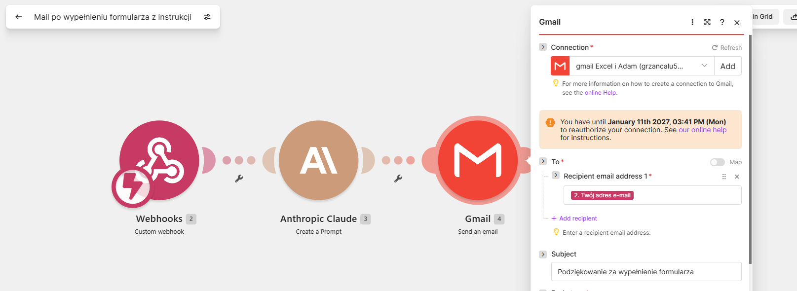

# Make.com: połączenie z Google/Gmail bez okresowej reautoryzacji



**Problem:** domyślne połączenie z Google w Make (używasz go np. w module Gmail) po jakimś czasie pokazuje komunikat w stylu „You have until [data] to reauthorize your connection" i trzeba ręcznie logować się od nowa, tak jak na zrzucie powyżej ze scenariusza z przewodnika [automatyzacja-mail-po-formularzu-przewodnik.md](automatyzacja-mail-po-formularzu-przewodnik.md).

**Przyczyna:** korzystasz wtedy z **wspólnej, domyślnej aplikacji Google należącej do Make**, a nie własnej. Google wymaga cyklicznego potwierdzania dostępu dla takich połączeń, szczególnie mocno gdy projekt aplikacji jest w statusie **Testing** (wtedy Google wymusza reautoryzację nawet co 7 dni).

**Rozwiązanie:** stwórz **własną aplikację OAuth w Google Cloud Console** (za darmo, kilka minut) i podepnij ją pod połączenie w Make zamiast korzystać z domyślnej. Po opublikowaniu własnej aplikacji w statusie **In production** wymóg cyklicznej reautoryzacji znika.

**Narzędzia, które otworzysz:** [Google Cloud Console](https://console.cloud.google.com/) · [Make](https://www.make.com/)

---

## 🗺️ Kolejność i gdzie co się dzieje

Cała instrukcja rozgrywa się w dwóch miejscach. Nie ma żadnej trzeciej aplikacji. Ekran logowania w Kroku 6 to ekran zgody samego Google, tylko wywołany z Make.

| Krok | Gdzie |
|---|---|
| 1. Nowy projekt | **Google Cloud Console** |
| 2. Włącz Gmail API | **Google Cloud Console** |
| 3. Ekran zgody OAuth + scope'y | **Google Cloud Console** |
| 4. Publikacja aplikacji (Production) | **Google Cloud Console** |
| 5. Client ID + Secret + redirect URI | **Google Cloud Console** |
| 6. Wklejenie danych i logowanie | **Make.com** |

Czyli kroki 1–5 robisz w całości w Google Cloud Console, zapisujesz Client ID i Secret, i tylko ostatni krok (6) wykonujesz w Make.

> 💡 **Które konto Google?** Projekt w Google Cloud Console (kroki 1–5) może założyć dowolne konto, to tylko „pojemnik" na Client ID/Secret. Liczy się konto, którym logujesz się w Kroku 6 („Sign in with Google"): to ono staje się skrzynką wysyłającą maile. Najprościej użyć jednego konta na wszystko, żeby się nie pogubić.

---

## Krok 1: 🆕 Nowy projekt w Google Cloud Console

1. Wejdź na [console.cloud.google.com](https://console.cloud.google.com/) i zaloguj się kontem Google (patrz uwaga o koncie powyżej).
2. Otwórz selektor projektów: kliknij nazwę projektu w lewym górnym rogu **albo** użyj skrótu **Ctrl+O**. Otworzy się okno „Wybierz projekt" z listą Twoich istniejących projektów.
3. W prawym górnym rogu tego okna kliknij **„Nowy projekt"**.
4. Podaj nazwę (np. „Make Gmail"), zostaw domyślną lokalizację → **Create**.

> ⚠️ Jeśli na liście widzisz już inne projekty (np. używane do innych rzeczy), **nie wybieraj żadnego z nich**, tylko utwórz nowy. Powód: patrz uwaga o koncie powyżej. Google pozwala na jeden ekran zgody OAuth na projekt, więc dorzucanie tej konfiguracji do istniejącego projektu mogłoby wymieszać się z tym, co tam już jest.

5. Po utworzeniu upewnij się, że nowy projekt jest aktywny (widoczny w selektorze na górze jako aktualnie wybrany).

---

## Krok 2: 🔌 Włącz Gmail API

1. Menu ☰ (lewy górny róg) → **Interfejsy API i usługi → Biblioteka** (albo bezpośrednio: [console.cloud.google.com/apis/library](https://console.cloud.google.com/apis/library), z aktywnym projektem z Kroku 1).
2. Wyszukaj **Gmail API** → otwórz → **Włącz**.

> 💡 Jeśli w tym samym scenariuszu Make korzystasz też z innych usług Google (np. Drive, Sheets), włącz analogicznie ich API — np. **Google Drive API**, jeśli dodajesz moduł Google Drive. W tym przewodniku (moduł „Gmail → Send an Email") wystarczy samo Gmail API, ale zasada jest taka sama dla każdej kolejnej usługi.

---

## Krok 3: 📋 Ekran zgody OAuth (Platforma uwierzytelniania Google)

1. Menu ☰ → **Interfejsy API i usługi → Ekran zgody OAuth**. Otworzy się strona **„Platforma uwierzytelniania Google" → Przegląd** → kliknij **„Rozpocznij"**.
2. **Informacje o aplikacji:** nazwa aplikacji (np. „Make gmail"), adres e-mail dla użytkowników potrzebujących pomocy → **Dalej**.
3. **Odbiorcy:** wybierz **„Z zewnątrz"** (nie „Wewnętrzny") → **Dalej**.
4. **Dane kontaktowe:** wpisz swój adres e-mail → **Dalej**.
5. **Zakończ:** zaakceptuj politykę danych użytkownika (Google API Services User Data Policy) → **Utwórz**.

### Zakres uprawnień (scopes)

1. W lewym menu przejdź do sekcji **Dostęp do danych**, kliknij **„Dodaj lub usuń zakresy"**.
2. Przewiń w dół do sekcji **„Ręczne dodawanie zakresów"** i wklej tam wszystkie 4 linki naraz (każdy w osobnej linii), zamiast szukać ich pojedynczo w tabeli powyżej (tabela ma dziesiątki stron wyników):

```
https://www.googleapis.com/auth/gmail.send
https://www.googleapis.com/auth/gmail.compose
https://www.googleapis.com/auth/gmail.modify
https://www.googleapis.com/auth/gmail.readonly
```

3. Kliknij **„Dodaj do tabeli"**.
4. Sprawdź, że wszystkie 4 scope'y trafiły do właściwych kategorii (`gmail.send` pod „Twoje zakresy wrażliwe", pozostałe trzy pod „Zakresy Gmaila" w sekcji „Twoje zakresy z ograniczeniami").
5. Kliknij **„Save"** na dole strony (ten jeden przycisk akurat został po angielsku, mimo spolszczonego interfejsu).

> ⚠️ Moduł „Send an Email" realnie potrzebuje tylko wysyłki, ale aplikacja Gmail w Make przy autoryzacji prosi o pełniejszy zestaw uprawnień. Jeśli w ekranie zgody zabraknie któregoś z powyższych, autoryzacja w Make zakończy się błędem niedopasowania uprawnień.

> 🚫 **Nie zaznaczaj „na zapas" wszystkich dostępnych scope'ów** (kusząca opcja przez „Select all rows" / 100 na stronę). W przeciwieństwie do redirect URI (Krok 5), scope'y to realne uprawnienia dostępu do danych — zasada „więcej nie szkodzi" tu nie działa. Zbędnie szeroki zestaw łamie zasadę minimalnych uprawnień (większe pole nadużycia, gdyby kiedyś wyciekł Client Secret) i utrudniłby ewentualną pełną weryfikację Google w przyszłości. Dodawaj tylko to, czego dany moduł faktycznie potrzebuje — patrz metoda w Kroku 5 (ta sama diagnostyka co dla redirect URI pokazuje też dokładny wymagany `scope`).

#### Dodatkowo: scope'y dla Google Drive

Jeśli w scenariuszu używasz też modułu **Google Drive**, dodaj analogicznie (metodą „Ręczne dodawanie zakresów" jak wyżej) — potwierdzone wprost z komunikatu błędu przy łączeniu Drive:

```
https://www.googleapis.com/auth/drive.readonly
https://www.googleapis.com/auth/userinfo.profile
https://www.googleapis.com/auth/userinfo.email
openid
```

> ⚠️ `drive.readonly` daje **tylko odczyt**. Jeśli Twój moduł Drive też **zapisuje/wgrywa/tworzy pliki** (np. „Upload a File", „Create a Folder"), zamiast (lub obok) `drive.readonly` może być potrzebny szerszy zakres `https://www.googleapis.com/auth/drive` (pełny dostęp) albo węższy `https://www.googleapis.com/auth/drive.file` (tylko pliki utworzone przez tę aplikację) — sprawdź dokładny wymagany scope metodą z Kroku 5, jeśli Twój moduł różni się od tego, co tu opisane.

---

## Krok 4: 🚀 Publikacja aplikacji (kluczowy krok!)

1. Przejdź do sekcji **Odbiorcy** (lewe menu „Platformy uwierzytelniania Google").
2. Przy „Stan publikacji: Testowanie" kliknij **„Opublikuj aplikację"**.
3. Google pokaże dialog **„Przenieść do środowiska produkcyjnego?"** z informacją, że przy zakresach wrażliwych/z ograniczeniami może być potrzebna weryfikacja. Dla prywatnej aplikacji, z której korzystasz tylko Ty, kliknij **„Potwierdź"**. Pełna weryfikacja Google (czasem płatny audyt) nie jest tu potrzebna.
4. Na stronie „Odbiorcy" pojawi się żółte ostrzeżenie „Twoja aplikacja wymaga weryfikacji" z przyciskiem „Otwórz centrum weryfikacji" — **zignoruj je**, nie jest potrzebne do samego działania połączenia.

> ✅ To jest krok, który realnie usuwa wymóg cyklicznej reautoryzacji. Stan publikacji **„Testowanie"** wymusza odświeżanie połączenia w Make nawet co 7 dni. Stan **„W wersji produkcyjnej"** (nawet niezweryfikowany) tego nie robi.

---

## Krok 5: 🔑 Dane logowania (Identyfikator klienta + Tajny klucz klienta)

1. Wciąż w **„Platformie uwierzytelniania Google"** → **Klienci** (lewe menu) → **„+ Utwórz klienta"**.
2. **Typ aplikacji:** **„Aplikacja internetowa"**.
3. Nadaj nazwę (np. „Make connection").
4. Sekcję **„Autoryzowane źródła JavaScriptu"** pomiń (nie jest potrzebna). W sekcji **„Autoryzowane identyfikatory URI przekierowania"** kliknij **„+ Dodaj URI"** i dodaj poniższe adresy (osobne wpisy, klikając „+ Dodaj URI" za każdym razem):

```
https://www.make.com/oauth/cb/google-email
https://www.integromat.com/oauth/cb/google-email
```

> ⚠️ To jedyne dwa **konieczne** dla modułu **Gmail → Send an Email** — potwierdzone bezpośrednio z komunikatu błędu Google (`redirect_uri_mismatch`), nie z domysłu.

Jeśli w tym samym scenariuszu planujesz też moduł **Google Drive**, dodaj analogicznie:

```
https://www.make.com/oauth/cb/google-drive
https://www.integromat.com/oauth/cb/google-drive
```

> 📌 **Każdy typ połączenia Google w Make ma własny, dedykowany sufiks redirect URI** — Gmail to `google-email`, Drive to `google-drive`. Nie da się tego wiarygodnie zgadnąć ani skopiować z ogólnych list krążących w internecie (różne źródła podają różne, często nieaktualne warianty jak `google-restricted`). Dla **każdego nowego typu modułu Google**, którego jeszcze nie masz na liście, zastosuj metodę z ramki poniżej, zamiast dogadywać sufiks.

Opcjonalnie możesz dorzucić jeszcze ten wariant — nie jest konieczny dla Gmaila ani Drive'a, ale w oknie „Create a connection" w Make widnieje osobny typ połączenia **„Google Restricted"** (obok „Google Drive"), który może się przydać, jeśli kiedyś rozszerzysz scenariusz o taki właśnie typ:

```
https://www.make.com/oauth/cb/google-restricted
https://www.integromat.com/oauth/cb/google-restricted
```

> 💡 Dodanie tego wpisu nie szkodzi, nawet jeśli go nie użyjesz — Google po prostu ignoruje nieużywane pozycje na liście redirect URI.

5. Kliknij **„Utwórz"** na dole.
6. Skopiuj i zapisz w bezpiecznym miejscu **Identyfikator klienta** oraz **Tajny klucz klienta** (klucz pokazuje się w pełni tylko raz, potem widać go już tylko zamaskowanego).

> 🔍 **Jeśli dostaniesz `redirect_uri_mismatch` w Make (przy Gmailu, Drive czy jakimkolwiek innym module Google):** na ekranie błędu Google kliknij **„szczegóły błędów"** (widoczne, bo jesteś zalogowany jako deweloper tej aplikacji). Pokaże dokładny `redirect_uri`, jakiego zażądał Make — dopisz go znak w znak do Google Cloud Console. To jedyna wiarygodna metoda, sprawdzona już dwa razy w tym przewodniku. Odczekanie kilkunastu minut na propagację też czasem pomaga, ale samo w sobie nie naprawi złego adresu.

### 🧭 Dodajesz nowy moduł Google w przyszłości? Oto metoda, nie zgadywanie

Wyszukiwanie „jaki redirect URI/scope ma moduł X" w internecie regularnie dawało w tym przewodniku złe albo nieaktualne odpowiedzi (różne fora, nawet oficjalny materiał kursowy Instytutu Kryptografii sugerowały inne warianty niż te faktycznie wymagane). Jedyna metoda, która zadziałała za każdym razem:

1. Spróbuj utworzyć połączenie w Make dla nowego modułu (**Sign in with Google**), nawet jeśli jeszcze nie masz kompletu redirect URI/scope'ów — i tak dostaniesz błąd, o to chodzi.
2. Na ekranie błędu Google kliknij **„szczegóły błędów"**.
3. W „Szczegóły żądania" znajdziesz **dokładny `redirect_uri`** oraz **dokładny `scope`**, jakiego ten konkretny moduł faktycznie potrzebuje.
4. Dopisz ten `redirect_uri` do „Autoryzowane identyfikatory URI przekierowania" (Krok 5) i dokładnie te `scope` do „Dostęp do danych" (Krok 3) — nic więcej, nic mniej.
5. Spróbuj ponownie.

Ta sama pętla działa niezależnie od tego, jaki to moduł Google — bo dokładnie w ten sposób znaleźliśmy `google-email` (Gmail) i `google-drive` (Drive) w tym przewodniku.

---

## Krok 6: 🔗 Podepnij dane logowania w Make

1. W scenariuszu Make dodaj (lub edytuj) moduł **Gmail → Send an Email**.
2. Przy polu **Connection** kliknij **Add** (nowe połączenie), a nie stare z listy.
3. Rozwiń **Show advanced settings**.
4. Wklej **Identyfikator klienta** i **Tajny klucz klienta** z Kroku 5.
5. **Sign in with Google** → zaloguj się tym samym kontem → zatwierdź uprawnienia.

> 🔒 Google może pokazać ekran „Ta aplikacja nie została zweryfikowana", to ten sam mechanizm, co przy pierwszym uruchomieniu skryptu Apps Script (patrz [automatyzacja-mail-po-formularzu-przewodnik.md](automatyzacja-mail-po-formularzu-przewodnik.md), Krok 2). Kliknij **Advanced/Zaawansowane** → **Go to [nazwa aplikacji] (unsafe)** → **Allow**. To bezpieczne, bo deweloperem aplikacji jesteś Ty sam.

6. Podmień to nowe połączenie we wszystkich modułach Gmail w scenariuszu, które wcześniej używały starego, domyślnego połączenia.

> 💡 Jeśli po autoryzacji Make pokaże komunikat dotyczący **„Refresh token"** — zignoruj go, kliknij **Save**, a potem otwórz moduł ponownie. Połączenie zwykle i tak działa poprawnie, to tylko chwilowy komunikat przy pierwszym zapisie.

---

## ✅ Efekt

Status **„W wersji produkcyjnej"** usuwa twarde, wymuszone wygaśnięcie połączenia co 7 dni, które dotyczy aplikacji w statusie Testing. To był główny problem, który rozwiązujemy tą instrukcją.

> ⚠️ **Uczciwe zastrzeżenie:** mimo to w Make może nadal pojawić się komunikat „You have until [data] to reauthorize" z terminem odległym o ~6 miesięcy. Wszystko wskazuje na to, że to osobne, informacyjne przypomnienie Make (niezwiązane ze statusem Testing/Production), a nie sygnał, że coś nie zadziałało. Token faktycznie używany (scenariusz działa regularnie) powinien się bez przerwy odświeżać. Całkowite usunięcie nawet tego komunikatu wymagałoby pełnej weryfikacji aplikacji przez Google (audyt bezpieczeństwa dla zakresów z ograniczeniami) — co dla prywatnego, jednoosobowego użytku jest nieproporcjonalnym wysiłkiem i nie jest tu potrzebne.

---

## Autor

**Adam Kopeć**: [friendlyai.pl](https://www.friendlyai.pl/) · [YouTube](https://www.youtube.com/@Friendly_AI_PL) · [adam@friendlyai.pl](mailto:adam@friendlyai.pl)
