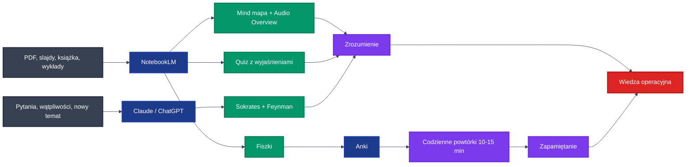
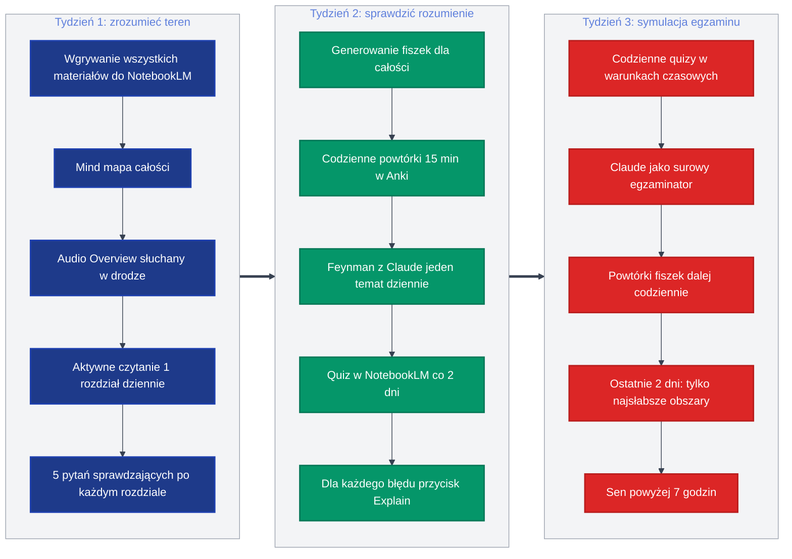

# Nauka z AI: praktyczny przewodnik


Techniki opisane w tym pliku nie wzięły się z powietrza. Feynman, active recall, spaced repetition, dialog sokratyjski. Każdą z nich badano dziesiątki lat przed erą AI i każda z nich wygrywała porównania z biernym czytaniem, powtórnym czytaniem i tradycyjnym "kucia na pamięć". AI nie zmienił tego, co działa w nauce, ale sprawił, że te techniki są dostępne bez korepetytora, bez grupy nauki i bez specjalnych warunków.

---

## Spis treści

1. [Zanim zaczniesz: dwie rzeczy ważniejsze niż wszystkie narzędzia razem wzięte](#1-zanim-zaczniesz)
   - Systematyczność bije wszystko
   - Mózg uczy się emocjami, nie powtórzeniami
2. [4 techniki, które naprawdę warto znać](#2-4-techniki)
   - Technika Feynmana
   - Active recall + spaced repetition
   - Dialog sokratyjski
   - Quiz z wyjaśnieniem każdej odpowiedzi
3. [Stack narzędzi: trzy aplikacje, koniec](#3-stack-narzędzi)
4. [NotebookLM: jak wyciągnąć z niego więcej](#4-notebooklm)
   - Audio Overview
   - Prezentacja
   - Quiz
   - Fiszki
   - Rozmowa z notatnikiem
5. [Workflow: od PDF do egzaminu w 3 tygodniach](#5-workflow)
6. [5 zasad i 3 pułapki](#6-zasady-i-pułapki)

---

## 1. Zanim zaczniesz: dwie rzeczy ważniejsze niż wszystkie narzędzia razem wzięte

### Systematyczność bije wszystko

Najlepszy stack AI w rękach kogoś, kto zaczyna na dzień przed egzaminem, to jak Ferrari w korku na S8 w piątek wieczorem. Silnik masz, ale czasu nie cofniesz.

Mózg konsoliduje wiedzę podczas snu, zwłaszcza w fazie REM. Powtórki działają tylko wtedy, gdy są rozłożone w czasie. Aktywne przypominanie wymaga, żeby było co przypominać. Wszystkie techniki z tego pliku zakładają jedno: zaczynasz wcześnie i wracasz regularnie.

Co się dzieje z wiedzą bez powtórek? Hermann Ebbinghaus zbadał to w 1885 roku i od tego czasu nikt tego nie podważył.

**Krzywa zapominania: ile pamiętasz po jednym czytaniu**

```
zaraz   ████████████████████████████████████████  100%
20 min  ███████████████████████▏                   58%
1 godz  █████████████████▌                         44%
1 dzień █████████████▏                             33%
6 dni   ██████████                                 25%
30 dni  ████████▍                                  21%
```

Po jednej lekturze, bez aktywnego przypominania, po 30 dniach masz w głowie 21% materiału. Jeśli czytasz książkę raz tydzień przed egzaminem, w dniu egzaminu pamiętasz mniej niż jedną czwartą.

Z powtórkami rozłożonymi w czasie każda kolejna sesja resetuje krzywą do 100%, a następny spadek jest wolniejszy. Po czterech-pięciu powtórkach materiał zostaje na lata.

| Strategia                              | Czas pracy | Co pamiętasz w dniu egzaminu | Co pamiętasz miesiąc po |
| -------------------------------------- | ---------- | ---------------------------- | ----------------------- |
| Systematycznie 2h dziennie przez 3 tyg | 42h        | 80%                          | 70%                     |
| Cramming 14h dzień przed               | 14h        | 60%                          | 5%                      |
| Tydzień po 3h                          | 21h        | 50%                          | 20%                     |

Matematyka jest brutalna. Cramming to nie strategia, to akt rozpaczy.

---

### Emocje/humor/zainteresowanie tematem ułatwiają naukę

Suchy podręcznik czytałeś tysiąc razy. Dowcip, który kolega opowiedział w gimnazjum na lekcji chemii, pamiętasz dosłownie. Mózg ma w sobie taki system priorytetów: nudne idzie do zapomnienia, śmieszne i szokujące zostaje na lata.

To nie jest mistycyzm. Amygdala oznacza emocjonalnie zabarwione informacje jako ważne, a hipokamp koduje je głębiej. Stąd wniosek dla osoby uczącej się: jeśli możesz wpleść humor, absurd, zaskoczenie albo osobistą historię, zrób to. Nie dlatego, że nauka ma być rozrywką, tylko dlatego, że tak działa Twój mózg.

**Po pierwsze**, kiedy tłumaczysz sobie temat, używaj absurdalnych porównań. Cykl Krebsa to nie "seria reakcji metabolicznych". Cykl Krebsa to księgowy, który dostaje fakturę za fakturą i każdą musi zaksięgować pod konkretnym kodem, inaczej skarbówka go odwiedzi.

**Po drugie**, AI w tym pomaga, ale trzeba je o to wprost poprosić. Domyślnie ChatGPT i Claude tłumaczą jak nauczyciel z liceum, który boi się, że dyrekcja go zwolni za zbyt luźny ton. Musisz im powiedzieć, że chcesz inaczej.

> **Prompt na naukę z humorem:**
> "Wyjaśnij mi [TEMAT] używając absurdalnych, ale zakorzenionych w prawdzie analogii z polskiej codzienności. Każda kluczowa idea powinna mieć jedno mocne porównanie, które zapamiętam. Na koniec zaproponuj 3 śmieszne mnemotechniki dla najtrudniejszych do zapamiętania faktów."

---

## 2. Cztery techniki, które naprawdę warto znać

Badania nad skutecznością metod nauki konsekwentnie wskazują te same kilka technik na szczycie listy. Poniższe cztery to nie subiektywny wybór, tylko wynik dziesiątek lat badań nad pamięcią i uczeniem się.

| #   | Technika                                  | Kiedy używać                        | Bez AI                                  | Z AI                                     |
| --- | ----------------------------------------- | ----------------------------------- | --------------------------------------- | ---------------------------------------- |
| 1   | **Feynman**                               | Sprawdzenie, czy naprawdę rozumiesz | Tłumaczysz partnerowi/lustru            | Claude jako sceptyczny dwunastolatek     |
| 2   | **Active recall + spaced repetition**     | Długoterminowe zapamiętanie         | Fiszki papierowe (system Leitnera)      | Anki + NotebookLM                        |
| 3   | **Dialog sokratyjski**                    | Wchodzenie w nowy temat             | Korepetytor, partner do nauki           | Claude/ChatGPT (ich największa przewaga) |
| 4   | **Quiz z wyjaśnieniem każdej odpowiedzi** | Przygotowanie do egzaminu           | Niemożliwe manualnie w rozsądnym czasie | NotebookLM                               |

### Technika Feynmana (jedyne prawdziwe sprawdzenie wiedzy)

Wytłumacz temat tak, jakbyś gadał z dziesięciolatkiem. Jeśli się zacinasz, jeśli musisz użyć żargonu, jeśli sam nie rozumiesz tego, co mówisz, to znaczy, że nie umiesz. Koniec, kropka, nie ma odwołania.

Z AI robisz to tak: piszesz wyjaśnienie własnymi słowami, wklejasz Claude'owi i mówisz "wciel się w sceptycznego dwunastolatka i wskaż każde miejsce, gdzie używam słów, których nie tłumaczę, albo gdzie moje wyjaśnienie zakłada, że już to wiesz".

---

### Active recall + spaced repetition (jedna metoda, dwie nazwy)

Aktywne przypominanie to wyciąganie wiedzy z głowy bez podglądania. Powtórki rozłożone w czasie to wyciąganie tej samej wiedzy w określonych odstępach: po 1 dniu, 3 dniach, 7, 14, 30. Razem dają najlepiej zbadany naukowo sposób długoterminowego zapamiętywania.

Bierne czytanie podręcznika trzeci raz daje tyle, ile trzecie obejrzenie tego samego odcinka serialu. Wiesz, co będzie dalej, ale niczego nowego nie zapamiętasz.

W praktyce: fiszki w Anki albo we wbudowanym systemie NotebookLM. Codziennie 10 do 15 minut. Generujesz fiszki raz, używasz codziennie. Przegrałeś tylko wtedy, kiedy przerwałeś.

> **Pułapka:** ludzie tworzą fiszki, robią je raz i zapominają. To jak kupić karnet na siłownię i wracać na niego patrzeć w portfelu. Same fiszki nie ćwiczą.

---

### Dialog sokratyjski (technika idealna dla AI)

Zamiast pytać "co to jest entropia", proś AI: "prowadź mnie pytaniami do zrozumienia entropii, nie tłumacz, dopóki nie utknę".

To jest jedyna technika, gdzie AI ma realną przewagę nad podręcznikiem. Książka pytań nie zadaje. Wykładowca zadaje 3 na 90 minut. AI robi to bez przerwy, bez znudzenia i bez oceniania, że pytasz głupio.

> **Prompt sokratyjski:**
> "Jesteś moim sokratyjskim korepetytorem od [TEMAT]. Nie wykładaj. Zadawaj jedno pytanie naraz. Po mojej odpowiedzi powiedz krótko, co rozumiem dobrze, a co źle, i zadaj następne pytanie. Wyjaśnienie podawaj tylko gdy poproszę o pomoc dwa razy z rzędu."

---

### Quiz z wyjaśnieniem każdej odpowiedzi

To technika prosta, ale w 90% szkół nie istnieje. Robisz quiz, sprawdzasz odpowiedzi, dla każdego błędu rozumiesz dokładnie dlaczego się pomyliłeś. Nie "przeczytałem ponownie rozdział", tylko "wiem, że pomyliłem X z Y, bo pamiętam tylko jedno z dwóch słów kluczowych".

NotebookLM i podobne narzędzia generują quizy z Twoich materiałów, gdzie każda błędna odpowiedź jest wyjaśniona z odniesieniem do źródła. To rzecz, której manualnie nikt nie ma czasu zrobić, a AI robi w 30 sekund.

> **Prompt do Claude/ChatGPT:**
> "Stwórz quiz z 10 pytaniami z wgranego materiału. Każde pytanie ma 4 opcje. Po moim rozwiązaniu wyjaśnij dla każdego błędu, dlaczego błędna opcja brzmi wiarygodnie i jaką typową pomyłkę reprezentuje. Dla poprawnych odpowiedzi zaznacz, gdzie w materiale to znajdę."

---

## 3. Stack narzędzi: trzy aplikacje, koniec

Wybieranie narzędzi AI to dziś trochę jak wybieranie aplikacji do produktywności w 2018. Każdy poleca trzy nowe co tydzień, a Ty pół roku później dalej nie umiesz pisać do zeszytu. Trzymaj się prostego zestawu.

| Narzędzie            | Do czego                                                 | Kluczowa funkcja                                                                               | Status             |
| -------------------- | -------------------------------------------------------- | ---------------------------------------------------------------------------------------------- | ------------------ |
| **[NotebookLM](https://notebooklm.google.com)**       | Praca z konkretnymi źródłami (książki, slajdy, artykuły) | Mind mapy, fiszki, quizy, Audio Overview — wszystko na podstawie Twoich materiałów, z cytatami | Darmowe            |
| **[Claude](https://claude.ai) / [ChatGPT](https://chatgpt.com)** | Rozmowa, dialog sokratyjski, Feynman, planowanie         | Projects (Claude) lub Custom GPTs (ChatGPT) jako stały korepetytor z pamięcią                  | Free + płatne      |
| **[Anki](https://apps.ankiweb.net)**             | Długoterminowe zapamiętywanie                            | Spaced repetition, najlepszy algorytm na rynku, działa na każdym urządzeniu                    | Darmowe (poza iOS) |

Jak to się łączy w praktyce:



Jeśli ktoś poleca Ci czwarte narzędzie, zapytaj go, ile godzin tygodniowo realnie się uczy. Najczęściej okaże się, że pół godziny w niedzielę.

---

## 4. NotebookLM: jak wyciągnąć z niego więcej

NotebookLM różni się od ChatGPT i Claude jedną kluczową rzeczą: odpowiada wyłącznie na podstawie materiałów, które wgrasz, i pokazuje cytaty ze źródeł. Zero halucynacji na temat Twojego podręcznika.

Większość funkcji działa przez kliknięcie przycisku w panelu Studio. Domyślny wynik bez instrukcji jest jak referat naukowca o 14:00 na konferencji: poprawny, kompletny i tak pozbawiony energii, że zapomnisz, o czym był, zanim wyjdziesz z sali. Dlatego prawie zawsze warto coś wpisać w polu instrukcji.

Wszystkie poniższe prompty bazują na czterech technikach z rozdziału 2: Feynman, dialog sokratyjski, active recall i quiz z wyjaśnieniem. Plus zasada, że mózg zapamiętuje to, co emocjonalne. Ograniczam się do 2-3 najmocniejszych przykładów na funkcję.

---

### Audio Overview (podcast z Twoich materiałów)

Generuje kilkunastominutowy podcast z dwoma prowadzącymi AI. Przed wygenerowaniem masz pole "Dostosuj", gdzie możesz wpisać instrukcje. Po wygenerowaniu możesz kliknąć ikonę mikrofonu i wejść w **Interactive Mode**, gdzie podcast się zatrzymuje, a Ty zadajesz pytanie prowadzącym i wracasz do słuchania.

**Prompt 1: humorystyczna debata** *(emocjonalne kodowanie + Feynman)*

Mózg zapamiętuje to, co śmieszne i kontrowersyjne. Dwóch prowadzących, którzy się nie zgadzają, jest dziesięć razy ciekawszych niż dwóch przytakujących sobie ekspertów.

> "Przeprowadź dyskusję między dwoma prowadzącymi w stylu polskiego stand-upu. Jeden próbuje wytłumaczyć temat tak, jakby tłumaczył znajomemu przy piwie. Drugi czepia się każdego skrótu myślowego, używanego żargonu i niejasnej analogii. Mają używać konkretnych, absurdalnych porównań z polskiej codzienności do trudniejszych konceptów. Bez sztucznej grzeczności, ale bez chamstwa. Cel: po wysłuchaniu mam zapamiętać kluczowe idee, bo były śmieszne, nie dlatego że zostały trzy razy powtórzone."

**Prompt 2: podcast z aktywnym przypominaniem** *(active recall)*

Domyślny podcast prowadzi cię za rączkę. Ten zmusza do myślenia w trakcie słuchania.

> "Po każdej kluczowej idei prowadzący zadają pytanie do słuchacza i robią 5-sekundową pauzę, żeby mógł sobie odpowiedzieć w głowie. Dopiero potem omawiają odpowiedź. Pod koniec podcastu zadają 3 pytania syntetyzujące i nie odpowiadają na nie. Mówią: 'jeśli nie umiesz odpowiedzieć, wróć do rozdziału X.'"

---

### Prezentacja

Generuje prezentację Google Slides z wgranych materiałów. W oknie "Dostosuj prezentację" masz cztery zmienne:

| Ustawienie  | Opcje                   | Kiedy co wybrać                                              |
| ----------- | ----------------------- | ------------------------------------------------------------ |
| **Format**  | Szczegółowa prezentacja | Pełny tekst, do wysłania e-mailem lub samodzielnego czytania |
|             | Slajdy prezentera       | Hasła do omówienia na żywo, bez ściany tekstu                |
| **Język**   | Lista języków           | Wybierasz niezależnie od języka źródeł                       |
| **Długość** | Krótkie / Domyślny      | Krótkie do skrótu, Domyślny do pełnego pokrycia              |
| **Opis**    | Pole tekstowe           | Tu wpisujesz instrukcje, to najważniejsze pole               |

**Prompt 1: prezentacja w stylu Feynmana** *(technika Feynmana)*

Slajdy, które zrozumie ktoś, kto pierwszy raz słyszy o temacie. Jednocześnie sprawdzian dla Ciebie, czy materiał da się tak ułożyć.

> "Każdy slajd ma jedną główną myśl, jedną codzienną analogię i jeden konkretny przykład. Bez bullet pointów dłuższych niż 6 słów. Żadnego żargonu bez definicji. Jeśli pojęcie wymaga więcej niż jednego zdania wyjaśnienia, podziel na osobne slajdy. Każdy slajd musi być zrozumiały dla osoby, która zerknęła na niego pierwszy raz, bez kontekstu wcześniejszych slajdów."

**Prompt 2: prezentacja z aktywnym przypominaniem** *(active recall + quiz z wyjaśnieniem)*

Klasyczna prezentacja jest pasywna. Ta zmusza do produkcji wiedzy z głowy.

> "Po każdej sekcji wstaw slajd 'Sprawdź siebie' z 2-3 pytaniami otwartymi do tego, co właśnie omówione, bez podawania odpowiedzi. Następny slajd to 'Odpowiedzi z komentarzem': poprawna odpowiedź plus krótkie wyjaśnienie typowych pomyłek. Ostatni slajd prezentacji to 'Top 3 pułapki, w które wpadasz na egzaminie z tego materiału' z konkretnym uzasadnieniem dla każdej."

---

### Quiz

Quiz generuje pytania wielokrotnego wyboru z przyciskiem "Explain" dla każdego pytania. Nie ma pola instrukcji przed generowaniem, ale możesz sterować przez czat.

**Prompt 1: quiz aplikacyjny zamiast pamięciowego** *(quiz z wyjaśnieniem typowych pomyłek)*

Pytania pamięciowe ("co to jest X?") sprawdzają, czy widziałeś materiał. Pytania aplikacyjne sprawdzają, czy go rozumiesz.

> "Stwórz 10 pytań, które wymagają zastosowania wiedzy, nie jej zapamiętania. Format: 'co się stanie, gdy...', 'kiedy zastosować X zamiast Y', 'dlaczego w tej sytuacji nie zadziała Z'. Każde pytanie ma 4 opcje, gdzie błędne reprezentują konkretne, częste pomyłki, jakie popełniają osoby uczące się tego tematu. Przy każdej błędnej odpowiedzi wyjaśnij, jaki błąd myślowy ona reprezentuje, żebym wiedział, czego mam unikać."

**Prompt 2: quiz porównawczy** *(rozumienie a nie wkucie)*

Większość egzaminów pyta o różnice i podobieństwa, nie o izolowane definicje.

> "Stwórz 8 pytań, gdzie każde wymaga porównania dwóch konceptów z materiału lub wskazania kontrastu między nimi. Pytania w stylu: 'co odróżnia X od Y w sytuacji Z', 'która z tych metod zadziała w przypadku gdy...', 'jaka jest kluczowa różnica między A i B'. Wskaż w wyjaśnieniach, gdzie te koncepty się mylą najczęściej i dlaczego."

---

### Fiszki

Fiszki generują się jednym kliknięciem, bez pola customizacji. Sterujesz przez czat przed wygenerowaniem albo prosisz o przerobienie istniejącej talii.

**Prompt 1: fiszki w formacie Feynmana** *(technika Feynmana)*

Fiszki pamięciowe sprawdzają, czy znasz definicję. Fiszki Feynmana sprawdzają, czy rozumiesz.

> "Stwórz fiszki w tym formacie: przód to pytanie 'wytłumacz X tak, jakbyś tłumaczył dziesięciolatkowi'. Tył to: prosta analogia z codziennego życia (jedno zdanie), konkretny przykład (jedno zdanie), jedna sytuacja, w której ten koncept ma znaczenie (jedno zdanie). Bez żargonu na tyle. Jeśli muszę użyć terminu technicznego, definiuję go w nawiasie."

**Prompt 2: fiszki przyczynowo-skutkowe** *(rozumienie procesów)*

Większość ważnej wiedzy to nie definicje, tylko związki. Te fiszki uczą myśleć w łańcuchach.

> "Stwórz fiszki w formacie: przód 'co się dzieje, gdy [konkretna sytuacja z materiału]', tył 'skutek + dlaczego do niego dochodzi + co by się stało, gdyby zadziałał inny czynnik'. Pomiń pytania o gołe definicje. Skup się wyłącznie na związkach przyczynowo-skutkowych i procesach z materiału."

---

### Rozmowa z notatnikiem (czat)

Czat to najbardziej elastyczna część NotebookLM. Odpowiada wyłącznie na podstawie wgranych materiałów, z cytatami wskazującymi miejsce w źródle.

**Prompt 1: sokratyjski tutor** *(dialog sokratyjski)*

Najmocniejsza technika dla AI ze wszystkich, jakie znamy. Zamiast czytać wyjaśnienia, dochodzisz do nich pytaniami.

> "Bądź moim sokratyjskim korepetytorem od materiału w tym notatniku. Wybierz najważniejszy temat z całości i prowadź mnie pytaniami do jego zrozumienia. Zadawaj jedno pytanie naraz. Po mojej odpowiedzi powiedz krótko, co rozumiem dobrze, a co źle, cytując fragment źródła, który to potwierdza. Zadaj kolejne pytanie pogłębiające. Wyjaśnienie podawaj tylko wtedy, gdy poproszę dwa razy z rzędu."

**Prompt 2: test Feynmana z weryfikacją źródłem** *(Feynman + cytaty)*

To miejsce, gdzie NotebookLM bije wszystko inne. Sprawdza Twoje wyjaśnienie nie tylko logicznie, ale też przeciwko konkretnym fragmentom źródła.

> "Wytłumaczę Ci teraz [TEMAT] własnymi słowami. Twoje zadanie: wciel się w sceptycznego dwunastolatka. Wskaż każde miejsce, gdzie używam żargonu bez wyjaśnienia, gdzie zakładam wiedzę, której nie podałem, albo gdzie moje wyjaśnienie jest sprzeczne z materiałem źródłowym. Dla każdego problemu zacytuj fragment ze źródła, który pokazuje jak powinno być. Na końcu oceń moje wyjaśnienie w skali 1-10 i powiedz, czego mam się jeszcze nauczyć."

**Prompt 3: identyfikacja kluczowego materiału** *(zasada Pareto)*

Zanim zaczniesz się uczyć, warto wiedzieć, czego naprawdę nie możesz pominąć.

> "Przeanalizuj cały materiał i podziel go na trzy kategorie: (1) absolutnie kluczowe, bez tego nic nie zrozumiem, (2) ważne dla pełnego obrazu, ale można pominąć w pierwszej rundzie, (3) szczegóły i ciekawostki. Dla każdej pozycji w kategorii 1 dodaj zdanie wyjaśniające, dlaczego jest kluczowa i jakie inne tematy się o nią opierają."

---

## 5. Workflow: od PDF do egzaminu w 3 tygodniach

Jeden konkretny przykład, który możesz adaptować. Zakłada 1-2 godziny dziennie i materiał, który masz w całości przed sobą.



To jest plan, który da Ci dobre wyniki. Stuprocentowy plan zaczyna się 6 tygodni przed egzaminem i wymaga, żebyś naprawdę chciał.

---

## 6. Pięć zasad i trzy pułapki

### Zasady

| #   | Zasada                              | Dlaczego                                                                                                                                        |
| --- | ----------------------------------- | ----------------------------------------------------------------------------------------------------------------------------------------------- |
| 1   | **Aktywnie, nie biernie**           | Czytanie podręcznika trzeci raz to nie nauka, tylko stwarzanie wrażenia, że się uczysz                                                          |
| 2   | **Jakość pytań > jakość narzędzia** | Najgorszy prompt do najlepszego AI da gorsze efekty niż najlepszy prompt do średniego AI                                                        |
| 3   | **Weryfikuj fakty**                 | AI halucynuje. Daty, nazwiska, cytaty potrafią być wymyślone z taką pewnością siebie, że zaczniesz w nie wierzyć. NotebookLM jest tu wyjątkiem. |
| 4   | **Mieszaj cyfrowe z analogowym**    | AI generuje fiszki, ale Ty piszesz odręczne notatki. Mózg zapamiętuje przez ruch ręki lepiej niż przez czytanie ekranu                          |
| 5   | **Mierz postęp tygodniowo**         | 10 minut: czego się nauczyłem, czego nie, co zmienić. Bez tego po miesiącu nie wiesz, czy idziesz do przodu czy w kółko                         |

### Pułapki

| #   | Pułapka                                    | Jak rozpoznać                                                                                                                  |
| --- | ------------------------------------------ | ------------------------------------------------------------------------------------------------------------------------------ |
| 1   | **Iluzja zrozumienia**                     | Czytasz wyjaśnienie AI, kiwasz głową, tydzień później nie pamiętasz nic. Lekarstwo: po każdej lekturze Feynman                 |
| 2   | **Kolekcjonowanie narzędzi zamiast nauki** | 6 godzin na testowaniu apek do fiszek, 12 artykułów porównujących Anki z Quizletem. To prokrastynacja, która wygląda jak praca |
| 3   | **Generowanie zamiast praktykowania**      | Masz 200 fiszek, 5 quizów i mind mapę na 4 ekrany, ale do żadnego nie zajrzałeś. Posiadanie materiałów do nauki nie jest nauką |

---

## Na koniec

Te techniki działały przed AI. Będą działać po AI. AI je przyspiesza, czyni dostępniejszymi i pozwala na rzeczy, które wcześniej wymagały korepetytora za 200 zł za godzinę. Ale fundament jest ten sam co zawsze: trzeba chcieć, trzeba być systematycznym i trzeba ćwiczyć aktywnie, nie biernie.

Jeśli zapamiętasz z tego pliku jedną rzecz, niech to będzie Feynman. Jeśli dwie, dorzuć powtórki rozłożone w czasie. Jeśli trzy, dodaj quiz z wyjaśnieniem każdej odpowiedzi.

Najlepszy moment, żeby zacząć systematyczną naukę, był wczoraj. Drugi najlepszy jest dzisiaj. Trzeci najlepszy moment nie istnieje, bo wtedy wszystko, co czytasz w tym pliku, jest już Ci do niczego niepotrzebne.

---

## Autor

**Adam Kopeć** — [friendlyai.pl](https://www.friendlyai.pl/) · [YouTube](https://www.youtube.com/@Friendly_AI_PL)
